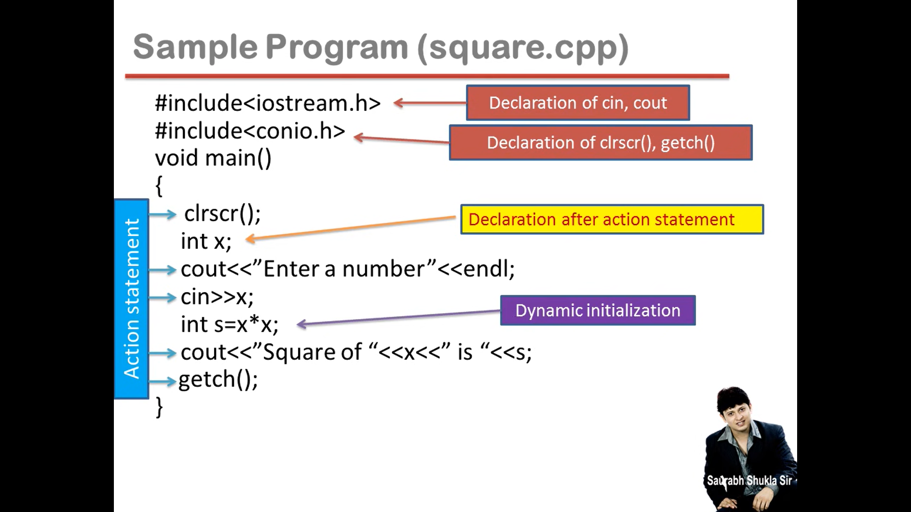
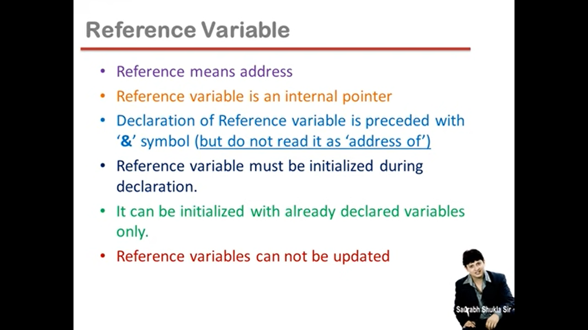

## Lec 1 - Introduction (P-1)

FACTS:

- C++‘s OOP aspect was inspired by a computer simulation language called Simula67

- JAVA is written in C++

- Major operating systems of modern times are written in C++

- C++ is worlds 4th most used programming language

Features of C++

- C++ is a middle level language

- C++ supports principles of object oriented paradigm

- C++ joins three separate programming traditions

— the procedural language tradition, represented by C;

— the object-oriented language tradition, represented by the class enhancements C++ adds to C;

— generic programming, supported by C++ templates

----------

## Lec 2 - Introduction (P-2)

Comparison between C and C++

- C++ is a superset of C language

- C++ programs can use existing C software libraries

- C follows top down approach of programming

By creating main() we decide the flow of the program and decides which function will be call and when.... we later Detailing/Defining the functionality... this type of approch is called Top-Down Approach...

- C++ follows bottom up approach of programming

In C++ it is easy to make Big softwares...

Bottom up approach means detailing is first i.e. defining of functionality... at last by assembling all the functionality... we take the decision of the flow of the program... i.e. main() function sabse aakhiree mai banate hai....

- C adopts Procedure Oriented Programming

- C++ adopts Procedure Oriented Programming as well as Object Oriented Programming... (C++ can implement POP as well as OOP).

Procedure Oriented Programming and Object Oriented Programming are the guidelines that how the programer have to make the program...

----------

## Lec 3 - Introduction (P-3)


**Object Oriented Programming**

- OOPs is a programming approach which revolves around the concept of ”Object".

- Any entity in the system that can be defined as a set of properties and set of operations performed using entity's property set, is known as Object.


Key Principle of OOP:

- Encapsulation

- Data Hiding

- Abstraction

- Polymorphism

- Inheritance


Encapsulation:

Act of combining properties and Methods/Operations/Functions related to the same object...


-----

## Lec 4 - Introduction (P-4)

Difference between Object and Variable:

- Object is a big memory block which consists of many Variables...

- whereas Variable ek single data contain karne wala block hai...(i.e. contains single value...)


**<u>Concept of Classes and Objects</u>**:


- Class is a blueprint of an Object...
  
  (means object kesa hoga memory mai... uske ander kitne variable honge... uska size kya hoga... ye sari  information hoti hai class ke ander....)


(While making a class... we create a  new data Type and this new data type called as Non-Primitive data type.... and the variable which is made from this new data type is called Object...)


- Class is a description of Object's property set and set of operations

- Creating class is as good as defining a new data type


Making a class is making a new DataType which is called User defined data type / Non-primitive data type / Customised data type...


- Class is a means to achieve encapsulation.

- Object is a run time entity

(Note: Class ko memory nahi milti... Memory milti hai object ko... Class is description of an Object... Object ko jo memory milegi, its depends on the no. of variables in the class...)

- Object is an instance (Example) of a class


**<u>Class vs Object</u>**:


box => DataType...

class => Keyword...


b1, b2, b3 => object...

Note: Value of l, b, h... is different... for b1, b2, b3...


-------

## Lec 5 - Introduction (P-5)


---------------

## Lec 6 - ldentifiers (Part-1)


**<u>Constants</u>**:

- Any information is constant

- Data = Information = constant


<u>Integer</u>:

23 , -341‚ 0, 5


<u>Real</u>:
3.4, -0.06‚ 3.0


<u>Character</u>:

'a', 'A', '+', '2', '   '                // Note:     '    '    => Space


*Rules to be a character*:

- length should be one character or one symbol...

- within single quotes('   ')


<u>String</u>:

e.g.:    "Nandan"            //    => Within "  " (Double Quotes)


<u>**Variables**</u>:

- Variables are the names of memory locations where we store data.

- Variable name is any combination of alphabet (a to z or A to Z), digit (0 to 9) and underscore ( _ )

- Valid variable name cannot start with digit.


<u>**Keywords / Pre-defined words / Reserved words**</u>: (Words which compiler knows the meaning...)


Note: 

Words which is in BLACK => Are exists in the C language...

Words which is in RED => Are new introduced in C++...

----------

## Lec 7 - Identifiers (Part - 2)

**<u>Data Types</u>**:

- int    =>    integer

(Using int data type, Banne wale variable mai hum rakhte hai Integer constant...)

- char   =>   character

(In char variable, we store character costant which is written under single quotes i.e.  '    ')

- float    =>   real

(In float variable, we store real costant )

- double    =>   real

(In double variable, we store real costant )

- void

 


------------+++++-------------

<u>Declare Variables Anywhere</u>: 

In C language, in every block i.e { }... we need to write the declaration statement before the action statement....

- Unlike C, you can declare variables even after action statements in C++.


clrscr => Action statement

int x=4;    => Declaration statement..


```c
// In C language, in every block i.e { }... we need to 
//write the declaration statement before the action statement....


Example: 
{
    clrscr();    //Action statement
    int x=4;    // Declaration statement..
}

The Error will be show here during execution because in C language the 
declaration statement should be use before action statement...

But in C++, we can write declaration statement after the action statement... 


```

---------

## Lec 8 - Input output Part 1


**<u>Output lnstruction</u>**:

- In C, standard output device is monitor and printf() is use to send data/message to monitor.

- printf() is a predefined function


- In C++, we can use cout to send data/message to monitor.

- cout is a **predefined object**.

- The operator << is called the insertion operator or put to operator.


<u>**Input Instruction**</u>:

- In C, standard input device is keyboard and scanf() is use to receive data from keyboard...

- scanf() is a predefined function.


- ln C++, we can use cin to input data from keyboard...

- The identifier cin is a **predefined object** in C++.

- The operator >> is known as extraction operator or get from operator...


<u>Remember</u>:

- According to the ANSI standards for C language, explicit declaration of function is recommended but not mandatory.

- ANSI standards for C++ language says explicit declaration of function is compulsory.


**<u>Header Files</u>**:

Predefined functions are declared in header files, so whenever you are using any
predefined function in your code, you have to include specific header file that contains its declaration.


<u>About **iostream.h**</u> :

- We need to include header file iostream.h‚ it contains declarations for the identifier cout and the operator <<. And also for the identifier cin and operator >>.

- Header file contains declaration of identifiers

- Identifiers can be function names, variables, objects, Macros etc


**<u>endl</u>**:

- Inserting endl into the output stream causes the screen cursor to move to the beginning of the next line.

- endl is a manipulator and it is declared in iostream.h

- ’\n’ character also works as it works in C...




Dynamic initialization    :  (i.e. Variable bana bhi rahe hai... aur ussi samay calculation karke ek Value assign karwa rahe hai... Aaur Calculation run time mai hoga... issi liye isse kahte hai Run time mai Initialise karna ya Dynamic Initilization....)


-----------------

## Lec 09 - Reference Variables in C++

Types of Variable: -

1) Ordinary Variable

2) Pointer Variable 

3) Reference Variable


**<u>Reference Variable</u>**:


int &y=x;

& is used to tell the compiler that "y" Variable is Reference Variable...

(NOTE: Don't call "&" as Address of...)

 


-------------------


