## Lec 10 - Function in C++ (Part 1)

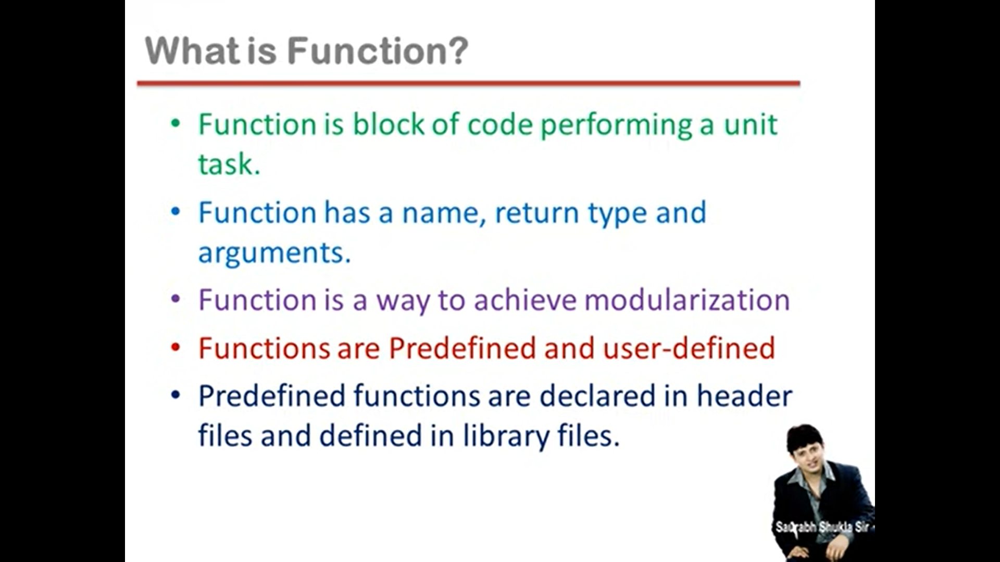

Modularization - (Convert Complex big task to small sub - tasks and Each sub task can be further divide and this dividing will continuously proceed untill we get Unit Task)

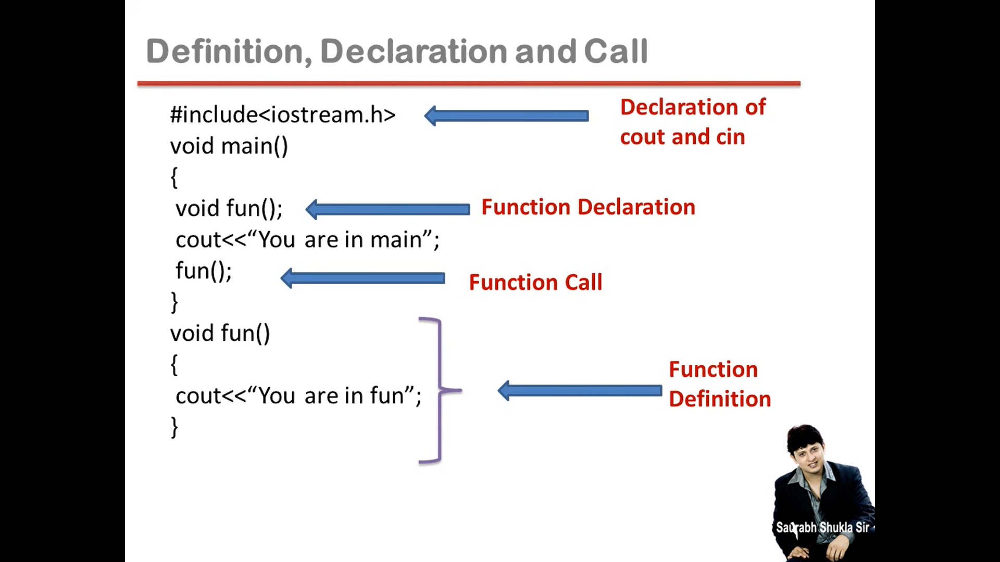

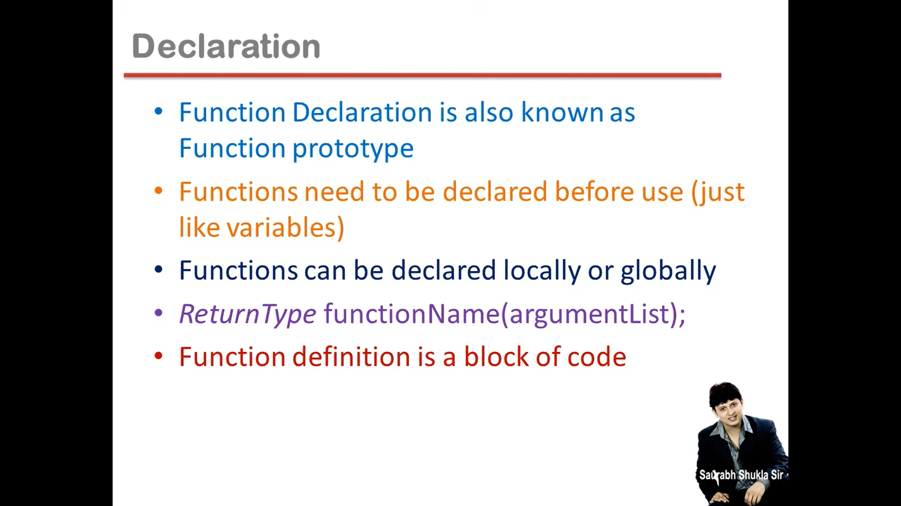

**<u>Ways to define a function</u>**?

- Takes Nothing, Returns Nothing

- Takes Something, Returns Nothing

- Takes Nothing, Returns Something

- Takes Something, Returns Something

**Formal and Actual Arguments**:

<u>Example of **Takes Something, Returns Something**</u>:

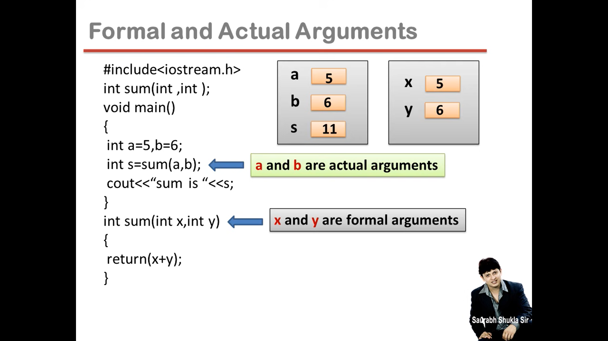

Formal Arguments : During Defining the function... the variables we make in the paranthsis (i.e. ( )) are called Formal Arguments.

**<u>Types of Formal Arguments</u>**:

- Formal arguments can be of three types
  — Ordinary variables of any type
  
  — Pointer variables
  
  — Reference variables

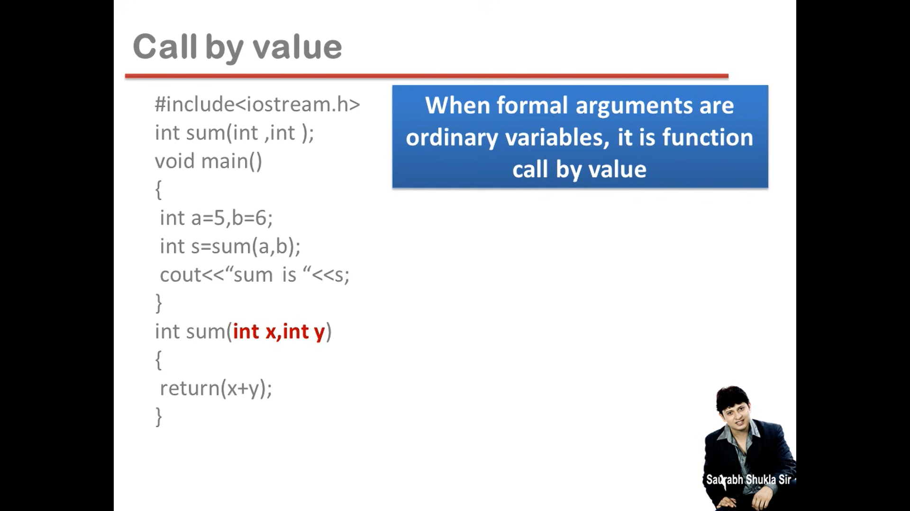


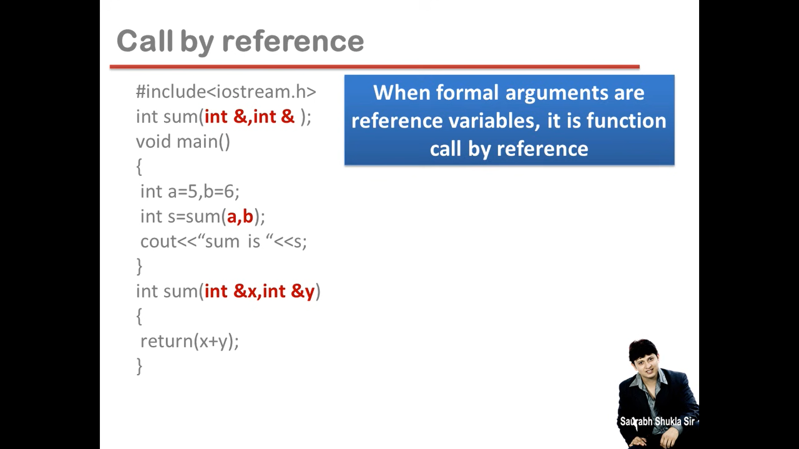

-------

## Lec 11 - Function in C++ (Part 2)

**<u>Benefits of function</u>**:

- Easy to read

- Easy to Modify

- Avoids rewriting of same code

- Easy to debug

- Better memory utilization

<u>Function saves memory</u>:

- Function in a program is to save memory space which becomes appreciable when a function is likely to be called many times.

<u>Function is time consuming</u>:

- However every time a function is called, it takes lot of extra time in executing a series of instructions for tasks such as jumping to the functions, saving registers, pushing arguments into the stack and returning to the calling function.

- So when function is small it is worthless to spend so much extra time in such tasks in cost of saving comparatively small space.

**<u>Inline Function</u>**:

- To eliminate the cost of calls to small functions, C++ proposes a new feature called
  inline function.

- An inline function is a function that is expanded in line when it is invoked.

- Compiler replaces the function call with the corresponding function code.

**<u>Inline is a request</u>**:

- inline is a request not a command.

- The benefit of speed of inline functions reduces as the function grows in size.

- So the compiler may ignore the request in some situations.

Few of them:

— Function containing Ioops, switch, goto.
— Functions with recursion
— Containing static variable.

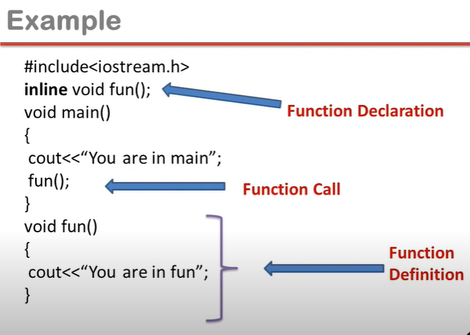

-------

## Lec 12 - Function in C++ (Part 3)

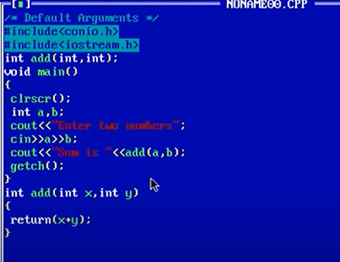

```cpp
// Example:
#include<iostream.h>
#include<conio.h>

int add(int,int);
void main()
{
    clrscr();
    int a,b;
    cout<<"Enter two numbers":
    cin>>a>>b;
    cout<<"Sum is"<<add(a,b);
    getch();
}
int add(int x, int y)
{
    return(x+y);
}
```

```cpp
// Default Arguments:
#include<iostream.h>
#include<conio.h>

int add(int,int,int=0);    // Default Arguments:
// int add(int,int=0,int=0);    // Default Arguments:

void main()
{
    clrscr();
    int a,b;
    cout<<"Enter two numbers ";
    cin>>a>>b;
    cout<<"Sum is"<<add(a,b);    // CASE - 1
    int c;
    cout<<"\n Enter three numbers "; 
    cin>>a>>b>>c;
    cout<<"sum is "<<add(a,b,c);    // CASE - 2
    getch();
}
int add(int x, int y, int z)
{
    return(x+y+z);
}
```

For add(a,b) ;  => In   int add(int x, int y, int z)   , z is considered to be ZERO...    because of Default Argument... i.e. int add(int,int,<u>**int=0**</u>);

Default Arguments: In Default Arguments, We make only 1 Function but can call in various varities by passing different Arrguments...

----------

## Lec 13 - Function in C++ (Part 4)

To impliment the Object Oriented Principles, C++ provides the features...

Polymorphism is one of the principle of Object Oriented Principle... which means One thing has multiple intepretation and Every intepretation must be clear in different context...

In C++; Polymorphism can be impliment in 3 ways:

- Function Overloading

- Operator Overloading

- Virtual Function...

NOTE: 

- Function Overloading and Operator Overloading are known as Compile Time Polymorphism...

- Virtual Function is known as Run Time Polymorphism...

```cpp
// Naming the more than one function will be same...
```

**<u>Function Overloading</u>**:

(Ek se jayada functions ki defination with the same name    //    Ek se jayada functions jinke naam same ho...)

When one function name is overloaded with differnet jobs...it is known as function overloading...

```cpp
// Function Overloading Example
#include<iostream.h>
#include<conio.h>
float area(int);    // Declaration For circle
int area(int, int);    // Declaration For Rectangle
void main()
{
    clrscr();
    int r;
    cout<<"Enter radius of a circle ";
    cin>>r;
    float A=area(r);    // Function Call for Area of Circle
    cout<<"\n Area of Circle is "<<A;

    int l,b,a;
    cout<<"\n Enter length and breadth of rectangle ";
    cin>>l>>b;
    a=area(l,b);    // Function Call for Area of Rectangle
    cout<<"Area of Rectangle is "<<a;
    getch();
}


float area(int R)    // Defining Area of Circle
{
    return(3.14*R*R);
}

int area(int L, int B)    // Defining Area of Rectangle
{
    return(L*B);
}
```

Early Binding    :-    (Compile time par Binding (i.e. Jod dena) kar dena)

(Function call pr konsi wali defination chalni wali hai... ye compile time pr taii ho jata hai...) 

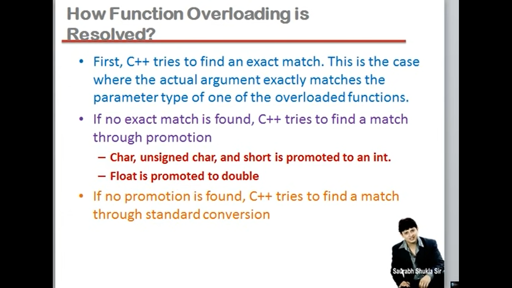

----------

## Lec 14 - Structure in C++ (Part 1)

Three important points:

- Structure is collection of similar and dissimilar elements

- Structure is a way to group variables

- Structure is used to create data type

-------

## Lec 15 - Structure in C++ (Part 2)

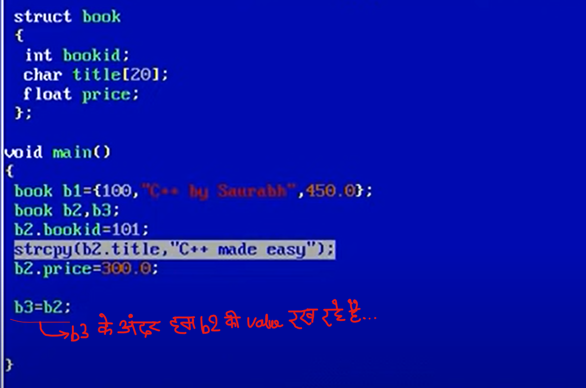

    struct book
    {
        int bookid;
        char title[20];
        float price;
    }
    
    void main()
    {
        book b1;    // struct book b1; => See NOTE
    }
    
    -----------------------------------
    struct book
    {
        int bookid;
        char title[20];
        float price;
    }b2;    // Now b2 becomes global variable...
    (OR)
    //book b2;    //Now b2 becomes global variable...
    
    void main()
    {
        book b1;
    }

NOTE: struct keyword is optional in C++ (Within void main( )) but struct keyword is Compulsory in C language...

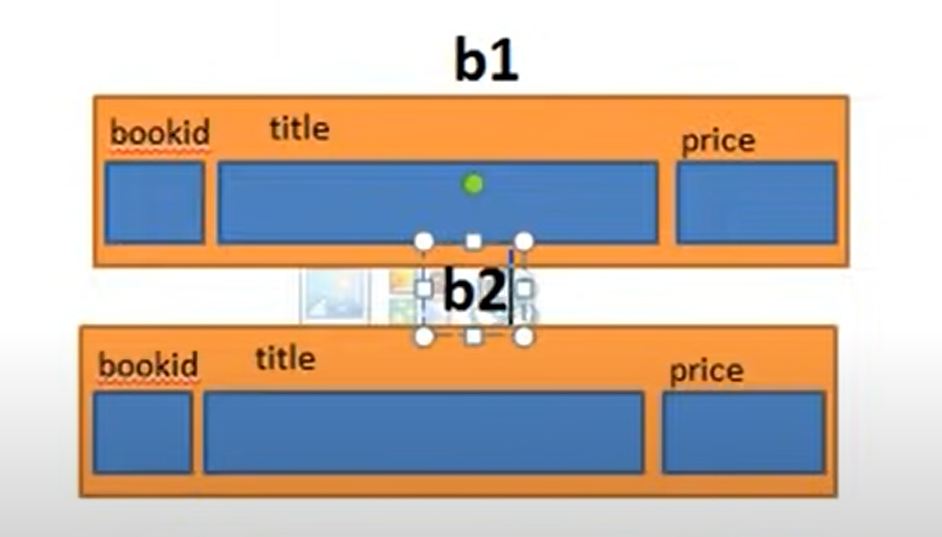

    book b2;
    b2.bookid=101;
    b2.title="C++ made easy";    => This is wrong
    
    
    Since we had write in left side of Assignment (i.e. =) b2.title it means
    we are writing the name of the Array (Since, title is an Array)
    Writing the name of the array represents the address of the first 
    block of the array and Address is a constant so there should not be
    constant exist in the left side of the assignment (i.e. =).
    So, Error will be form...
    
    If we don't want an error then we should know that how to assign an
    string in the character array...
    
    For this we use a function "strcpy"
    
    
    i.e. strcpy(b2.title,"C++ made easy");
    
    1st Argument i.e. b2.title    => This is address of the Array...
    2nd Argument i.e. C++ made easy    => We passed string

---------

## Lec 16 - Structure in C++ (Part 3)

```cpp
// Function returning structure...
// Takes nothing, return something

struct book
{
    int bookid;
    char title[20];
    float price;
};

void main()
{
    clrscr();
    book b1; 
    b1=input();
    getch();
}
book input()    // return type of input() function should be of book...
{
    book b;
    cout<<"Enter bookid, title and price of book ";
    cin>>b.bookid>>b.title>>b.price;
    return(b);
}
```

```cpp
// Function call by passing structure...

//returns nothing
#include<iostream.h>
#include<conio.h>

struct book
{
    int bookid;
    char title[20];
    float price;
};

void display(book);
book input();

void main()
{
    clrscr();
    book b1; 
    b1=input();
    display(b1);    // Function call by passing structure...
    getch();
}

void display(book b)
{
    cout<<"\n"<<b.bookid<<" "<<b.title<<" "<<b.price;
}

book input()
{
    book b;
    cout<<"Enter bookid, title and price of book ";
    cin>>b.bookid>>b.title>>b.price;
    return(b);
}
```

-------

## Lec 17 - Structure in C++ (Part 4)

**<u>Incapsulation</u>** (One of the five key principles of OOPs) => 

It is an act of combining properties and methods related to the same entity...

(Ek Entity se related sari property or sare methods ka ek single group banana chahiye...)

(OR)

(Ek Single group banana... variables aur functions ka...)

NOTE:-

In structure of C language, Group only contains variables...

But in structure of C++, We can store Variable as well as function...

```cpp
//Example to show structure of C++ store Variable as well as function...


#include<iostream.h>
#include<conio.h>

struct book    
// Structure stores 5 members in the body i.e. 3 variables and 2 functions
{
    int bookid;        //Variable
    char title[20];    //Variable
    float price;        //Variable
    void input()        //Function
    {
        cout<<"Enter bookid, title and price of book ";
        cin>>bookid>>title>>price;
    }
    void display()        //Function
    {
        cout<<"\n"<<bookid<<" "<<title<<" "<<price;
    }
};

void main()
{
    clrscr();
    book b1; 
    b1.input();   
/* 
function input() and display() are the member of structure so we 
need to use dot operator i.e.  b1.input();  and  b1.display();
*/
    b1.display();
    getch();
}
```

Note: Agar hum function ko structure ke body ke ander banayenge to ye function bhi variables ki tarah member function kehlayega...

like bookid, title, price member variables hai... input() member function kehlayega...

- Member functions has special benefits  i.e. Apne hi structure ke kisi bhi member ko directly access kar sakta hai bina dot Operator ke like... (cin>>bookid>>title>>price;)

Since previously It Was  (    cin>>b.bookid>>b.title>>b.price;    )

-----------

## Lec 18 - Structure in C++ (Part 5)

In C++, we can decide the Access rule for the members i.e. From where they can be Accessible....

```cpp
// Data Security in structure

#include<iostream.h>
#include<conio.h>

struct book    
{
    int bookid;    
    char title[20];
    float price;
    void input()
    {
        cout<<"Enter bookid, title and price of book ";
        cin>>bookid>>title>>price;
        if(bookid<0)    //SEE
        bookid=-bookid;
    }
    void display()
    {
        cout<<"\n"<<bookid<<" "<<title<<" "<<price;
    }
};

void main()
{
    clrscr();
    book b1; 
    b1.bookid=-100;    // Data Currupt of bookid
    b1.input();   
    b1.display();
    getch();
}
```

In C language there is no any way to stop the Data Currupt...

But in C++ there is a way to stop the Data Currupt...

Now we need to use the <u>Access specifier</u>

Three types of <u>Access specifier</u>:

- Private

- Protected

- Public

```cpp
#include<iostream.h>
#include<conio.h>

struct book    
{
    private:    //SEE Note 1.
        int bookid;    
        char title[20];
        float price;
    public:        //Note 2.
    void input()
    {
        cout<<"Enter bookid, title and price of book ";
        cin>>bookid>>title>>price;
        if(bookid<0)    //SEE
        bookid=-bookid;
    }
    void display()
    {
        cout<<"\n"<<bookid<<" "<<title<<" "<<price;
    }
};

void main()
{
    clrscr();
    book b1; 
    b1.bookid=-100;    // No use after use of Private Access specifier
 // Error will form i.e. "bookid" is not accessible...
    b1.input();   
    b1.display();
    getch();
}
```

Note1:

<u>Private Access specifier</u>: 

It helps that members (variables and functions) will not allowed to access outside of the structure body... Members can only access from inside the body...

Note 2: 

Here input( ) function also gets private so we need to use **<u>Public Access Specifier</u>**.

So, void input() and void display() gets public...

Result: 

Only 3 members in the structure are private i.e. bookid, title and price...

and two member functions i.e. input() and display() are public...

i.e. Data gets secured....

---------------


