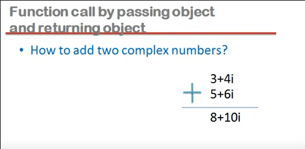
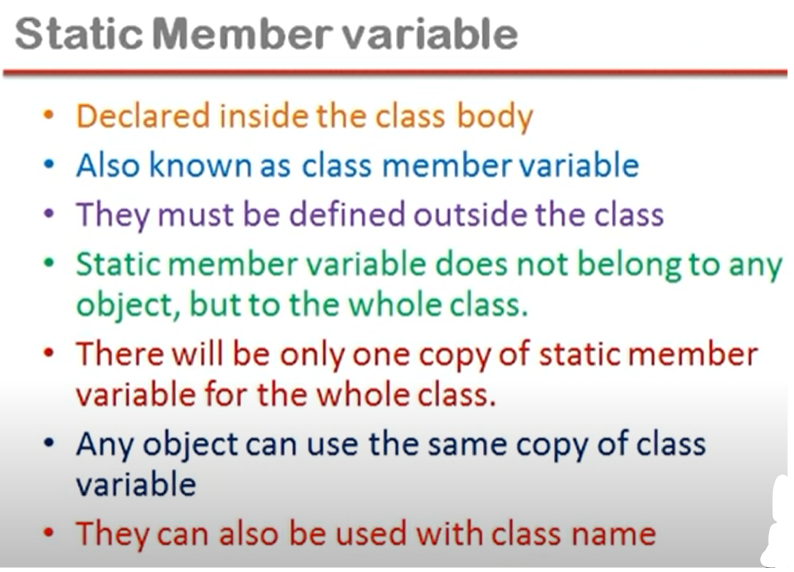
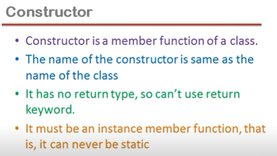
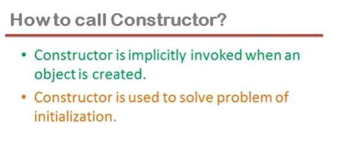
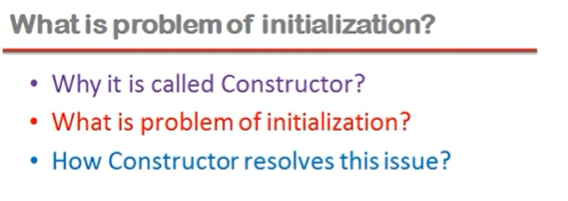
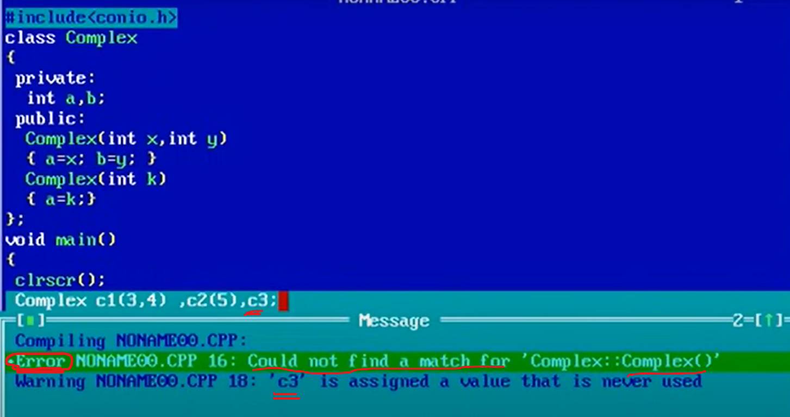
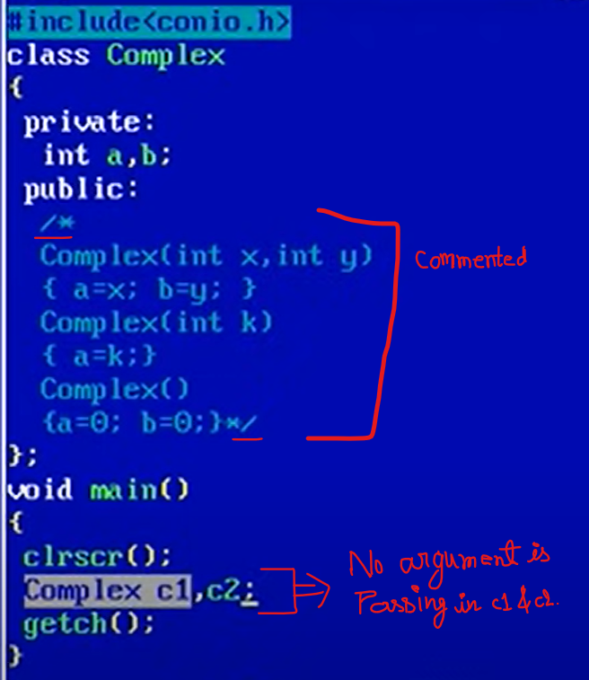
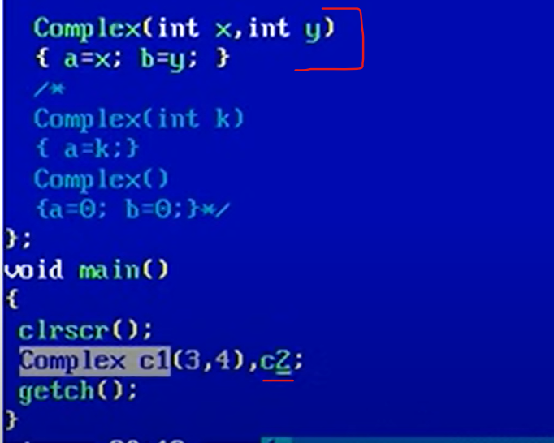
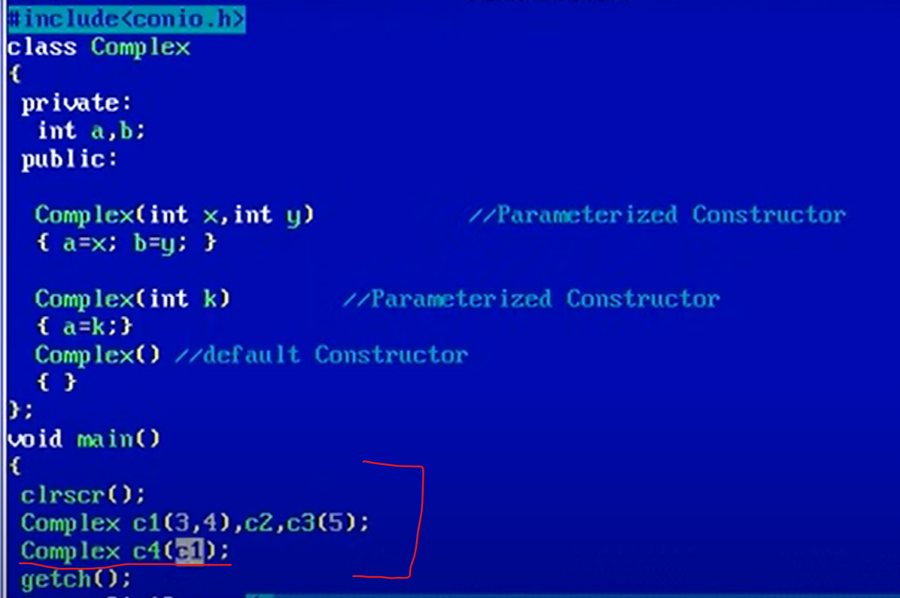
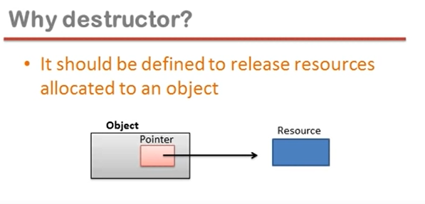

## Lec 19 - Classes and Objects (Part 1)

**<u>Class and Structure</u>**:

The only difference between structure and class is that,

- the members of structures are by default public
  and

- the members of class are by default private.

```cpp
// Example
#include<iostream.h>
#include<conio.h>
struct Complex
{
    private:
        int a,b;
    public:
    void set_data(int x, int y)
    {
         a=x;b=y;   
    }
    void set_data()
    {
        cout<<"\na="<<a<<" b="<<b;    
    } 
    };
void main()
{
    clrscr();
    Complex c1;
    c1.set_data(3,4);
    c1.show_data();
    getch();    
}
```

```cpp
#include<iostream.h>
#include<conio.h>
class Complex    // class will work same as struct
{
    private:
        int a,b;
    public:
    void set_data(int x, int y)
    {
         a=x;b=y;   
    }
    void set_data()
    {
        cout<<"\na="<<a<<" b="<<b;    
    } 
    };
void main()
{
    clrscr();
    Complex c1;    // c1 will  be object because of class
    c1.set_data(3,4);
    c1.show_data();
    getch();    
}
```

```cpp
#include<iostream.h>
#include<conio.h>
class Complex
{
    private:
        int a,b;
    public:
    void set_data(int,int);
    void set_data()
    {
        cout<<"\na="<<a<<" b="<<b;    
    } 
    };
    void Complex:: set_data(int x, int y)
    {
         a=x;b=y;   
    }
void main()
{
    clrscr();
    Complex c1;
    c1.set_data(3,4);
    c1.show_data();
    getch();    
}
```

Complex::     => membership label

Complex    => Name of the class...

agar membership label laga diya aaur ander declaration kar diya to ye mana jaayega ki ye function bhale hi bahar defined hai pr Complex class ka member function hai...

Agar class ke ander kisi function ko defined karte hai to wo by default INLINE hota hai...  jabki bahar defined karte hai to usse INLINE banane ke liye INLINE keyword declaration ke waqt likhna padta hai...

--------------

## Lec 20 - Classes and Objects (Part 2)



```cpp
// Function call by passing object and returning object:

#include<iostream.h>
#include<conio.h>
class Complex
{
    private:
        int a,b;
    public:
    void set_data(int x,int y);
     {
         a=x;b=y;   
    }
    void show_data()
    {
        cout<<"\na="<<a<<" b="<<b;    
    } 
    Complex add(Complex c)
    {
        Complex temp;    //temp is an Object which includes a and b...
        temp.a=a+c.a;
        temp.b=b+c.b;
        return(temp);
    }
 };

void main()
{
    clrscr();
    Complex c1,c2,c3;
    c1.set_data(3,4);
    c2.set_data(5,6);
      //  c3=c1+c2;    //<=    Wrong
    c3=c1.add(c2);
    c3.show_data();
    getch();    
}
```

// c1, c2 and c3 are instances (objects) of  class complex....

//    set_data, show_data, add are Instance member function...

c3=c1+c2; Gives Error because operands of the Operator are of non-primitive type... and compiler don't know the defination to operate them, So error will be showing...

c3=c1.add(c2);    =>    c1 ne add function ko call kiya (i.e. c1 is a caller object aaur add uska member function hai...), c2 as an Argument pass hua aaur jo add function ne return kiya wo  c3 mai assign huaa...

```cpp
// Function call by passing object and returning object:
// Same as previous (More Understanding)
#include<iostream>
using namespace std;
class Complex
{
    private:
        int a,b;
    public:
    void set_data(int x,int y)
     {
         a=x;b=y;   
    }
    void show_data()
    {
        cout<<"\na="<<a<<" b="<<b;    
    } 
    Complex add(Complex c)
    {
        Complex temp;    //temp is an Object which includes a and b...
        temp.a=this->a+c.a;     // temp.a = c1.a + c2.a;
        temp.b=this->b+c.b;
        return(temp);
    }
 };

int main()
{

    Complex c1,c2,c3;
    c1.set_data(3,4);
    c2.set_data(5,6);
      //  c3=c1+c2;    //<=    Wrong
    c3=c1.add(c2);
    c3.show_data();
    return 0;   
}
```

-----------

## Lec 21 - Classes and Objects (Part - 3)

<u>Technical jargons</u>

- Class is a description of an object

- Object is an instance (i.e.  Example) of a class

- lnstance member variable
  — Attributes, data members, fields, properties

- lnstance member functions

        — Methods, procedures, actions, operations, services...

Member function of two types:

- Instance member function

- Class member function

State of an object should be change by its methods...

(State refers to kisi bhi object ke instance member variable ki values ke collection ko state bola jata hai...)

-------------

## Lec 22 - Static Members in C++ (Part 1)

Static local variables
Static member variables
Static Member Functions

**<u>Static local variables</u>**:

- Concept as it is taken from C

- They are by default initialized to zero

- Their lifetime is throughout the program

```cpp
#include<iostream>
using namespace std;
void fun()
{
    static int x;
    int y;
}


// y contains garbage value but x contains 0(zero)...
```


**<u>Static member variables</u>**:





 Variables which are made <u>**without** static keyword</u> inside class are called **<u>Instance Member Variable</u>**.

Variables which are made <u>**with** static keyword</u> inside class are called **<u>Static Member Variable</u>** (OR) **<u>Class member Variable</u>**.


```cpp
#include<iostream>
using namespace std;
class Account 
{
    private:
        int balance;    //Instance Member Variable
        static float roi;   //Static Member Variable (OR) Class Variable
    public:
        void setBalance(int b)
        {
            balance = b;
        }
};

float Account:: roi=3.5f;  // roi variable defined i.e. outside the class
int main()
{
    Account a1,a2;
};
```

Account::    =>     Membership Label    (See Lec - 19 as reference for Membership Label)

Account     =>     It is a Class 

//roi    =>    Rate of interest

a1,a2    =>    objects

Note:-    

a1, a2 object ke ander "balance" naam ka variable exist karta hai pr "roi" naam ka variable exist nahi karta hai...

Jitne object "Account" class ke banaye jaayenge har object ke ander balance naam ka variable hoga... pr roi naam ka variable puri class ke liye sirf ekk baar banega... Aur object ke banne na banne se usspr koi pharak nahi padta... i.e. Agar humne ek bhi object nahi banaya phir bhi "roi" banega... ek object banaya phir bhi "roi" banega...  agar 10 object baanao phir bhi "roi" ek hi baar banega...


Account::roi=4.5;    => We can access "roi" variable and Assign value in it... if "roi" is public...

-------

## Lec 23 - Static Members in C++ (Part 2)

(contd. Previous lec...)

Account::roi=4.5;    => We can access "roi" variable and Assign value in it... if "roi" is public...


```cpp
#include<iostream>
using namespace std;
class Account 
{
    private:
        int balance;    //Instance Member Variable
        static float roi;   //Static Member Variable (OR) Class Variable
    public:
        void setBalance(int b)
        {
            balance = b;
        }
       static void setRoi(float r)    // static member function
        {
            roi = r;
        }
};

float Account:: roi=3.5f;  // roi variable defined i.e. outside the class
int main()
{
    Account a1,a2;
    a1.setRoi(4.5f);
    Account::setRoi(4.5f);

    return 0;
};
```


setBalance, setRoi    => are Instance member functions (But HOW??)

a1.setRoi(4.5f);    // Humne Account class ke Instance member function ko call kiya... object (i.e. a1) dot laga ke...


static void setRoi(float r)    =>    Bina object  ke call karne ke liye... static use kiya gaya hai... So this will call as Static Member Function... and static member function can be call without an object...

::    =>     Scope resolution operator...

Account::setRoi(4.5f);    => Aagar object nahi hai, to isko call karne ke liye class ka naam, Scope resolution operator, aur fir function call likhna hoga...

It means static member function can be call without an object...

<u>Conclusion</u>:

Static member variable can be accessed with class name... only if variable is public...


 -------

## Lec 24 - Constructor in C++ (Part 1)

**<u>Constructor</u>**:




```cpp
#include<iostream>
using namespace std;
class Complex
{
    private:
        int a,b;
    public:
        Complex()    // Constructor //SEE NOTE
        { 
        
            }  
};
```

NOTE:    The name of the constructor is same as the name of the class... and there will be no return type...




Implicitly invoked:    (Isse hum call nahi karte hai... ye call apne aap hota hai...)


```cpp
#include<iostream>
using namespace std;
class Complex
{
    private:
        int a,b;
    public:
        Complex()    
        { 
              cout<<"HELLO CONSTRUCTOR ";
         }  
};


int main()
{
    // Complex c1;    //Runs one time
    Complex c1,c2,c3;    //Runs 3 times
    return 0;
}
```

c1 => object of Complex class...





<u>Note</u>: 

Constructor object ko object banata hai...

Constructor ek aisa guraanted function hai jo object ke bante hi call ho jata hai...

(Jo kaam object ke bante hi kara dena hai... wo aap Constructor mai likh digiye... khas tor pr initialisation of member variable...)

-----------

## Lec 25 - Constructor in C++ (Part 2)


```cpp
//Example of Constructor Overloading
#include<iostream>
using namespace std;
class Complex
{
    private:
        int a,b;
    public:
        Complex(int x,int y)    //Parameterized Constructor
        { a=x; b=y; }
        Complex(int k)            //Parameterized Constructor
        { a=k; } 
        Complex()            //Default Constructor
        { a=0; b=0;} 
};


int main()
{
    Complex c1(3,4), c2(5), c3; 
    // Complex c1=Complex(3,4), c2=Complex(5), c3; // Same meaning
    // Complex c2=5;    // Work only for single value...
    return 0;
}
```

Complex class mai aisa koi constructor moojud nahi hai jo koi argument/parameter na leta ho...




Note:

Object banega to constructor to call hoga hi hoga...




If there is no any constructor in the class... but the  constructor will called in the program... because the compiler will form constructor by itself... which is called "Implicit Default Constructor".... (Because it is made by Compiler...)

In this auto made constructor there will be no Argument/Parameter pass...




Aagr humne ek bhi constructor bana diya.... to compiler "Implicit Default constructor" nahi banayega... and ERROR will form....


NOTE:

Default constructor... jo Compiler banata hai... ya hum bhi bana sakte hai... jisme koi Argument nahi hota hai...

----------

## Lec 26 - Constructor in C++ (Part 3)




Compiler in the class makes two constructor:    

(i) Default Costructor

(ii) Copy Constructor

for Complex c4(c1);


Points:

- Class mai agar koi bhi construtor nahi bana hai to compiler 2 constructors banayega:    Default Constructor and Copy Constructor...

- Aagr humne apne class mai koi Constructor bana diya hai... lekin jo banaya  hai wo copy constructor nahi banaya hai... to compiler Default Constructor nahi banayega pr Copy Constructor banayega...

- Agar hume class mai copy constructor bana diya hai to compiler Default Constructor and Copy Constructor dono hi nahi banega...

- Agar humne Copy Constructor nahi banaya hai... koi dusra constructor banaya hai... to Compiler bas Copy constructor hi banayega...


```cpp
#include<iostream>
using namespace std;
class Complex
{
    private:
        int a,b;
    public:
        Complex(int x,int y)    //Parameterized Constructor
        { a=x; b=y; }
        Complex(int k)            //Parameterized Constructor
        { a=k; } 
        Complex()            //Default Constructor
        { }
        Complex(Complex &c)    //    =>    Copy Constructor
        {    
        a=c.a;    
        b=c.b;
        } 
};


int main()
{
    Complex c1(3,4), c2(5), c3;
    Complex c4(c1);
    return 0;
}
```


Note:

Copy constructor bs wahi hota hai jisme complex type ka reference pass hota hai...

Jab bhi object banate hai... Aur banate waqt same class ka object usme pass karte hai to copy constructor call hota hai...

In copy constructor making of reference variable is compulsory bacause making of object causes ERROR...

----------

## Lec 27 - Destuctor in C++ (Part 1)

**<u>Destructor</u>**:

- Destructor is an instance member function of a class

- The name of the destructoris same as the name of a class but preceded by tilde (~) symbol

- Destructors can never be static

e.g.:    static ~Complex()    <=    Not Possible


- Destructor has no return type

e.g.:    int ~Complex()  ,  void ~Complex() etc...    <=    Not Possible


- Destructor takes no argument (No overloading is possible) 

e.g.:    ~Complex(int x)        <=    Not Possible


- It is invoked implicitly when object is going to destroy.


```cpp
#include<iostream>
using namespace std;
class Complex
{
    private:
        int a, b;
    public:
        ~Complex()
        {  cout<<"Destructor";  }
};
void fun()
{
    Complex obj;
}
int main()
{
    fun();
    return 0;
}
```


**Q.**   Why destructor?

Answer:    

It should be defined to release resources allocated to an object...

(Destructor wo function hai jo object destroy hone ke just pehle chalega...)





-------------------
