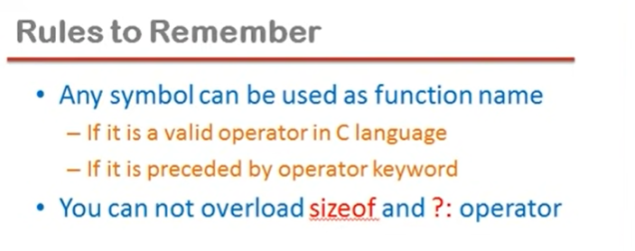

## Lec 28 - Operator overloading in C++ (Part 1)

```cpp
#include<iostream>
using namespace std;
class Complex
{
    private:
    int a, b;
    public:
    void setData(int x, int y)
    {
        a=x,b=y;
    }
    void showData()
    { cout<<"\na="<<a<<" b="<<b; }
    Complex add(Complex c)
    {
        Complex temp;
        temp.a=a+c.a;
        temp.b=b+c.b;
        return(temp); 
    }

};
int main()
{
    Complex c1,c2,c3;
    c1.setData(3,4);
    c2.setData(5,6);
    c3=c1.add(c2);
    c3.showData();
    return 0;
}
```

c3 = c1+c2     //     =>    Shows Error because compiler don't know how to add complex (i.e. Non-primitive type)...

c3=c1.add(c2);    //    =>    c1 ne add function ko call kiya, c2 as an argument pass hua aur add function ne jo return kiya wo c3 mai assign hua...

(add function is a Member function)

```cpp
// SEE Lec 20 as Reference...
// Same as previous (More Understanding)
#include<iostream>
using namespace std;
class Complex
{
    private:
        int a,b;
    public:
    void set_data(int x,int y)
     {
         a=x;b=y;   
    }
    void show_data()
    {
        cout<<"\na="<<a<<" b="<<b;    
    } 
    Complex add(Complex c)
    {
        Complex temp;    //temp is an Object which includes a and b...
        temp.a=this->a+c.a;     // temp.a = c1.a + c2.a;
        temp.b=this->b+c.b;
        return(temp);
    }
 };

int main()
{

    Complex c1,c2,c3;
    c1.set_data(3,4);
    c2.set_data(5,6);
      //  c3=c1+c2;    //<=    Wrong
    c3=c1.add(c2);
    c3.show_data();
    return 0;   
}
```

```cpp
//Same as previous program but using operator
#include<iostream>
using namespace std;
class Complex
{
    private:
    int a, b;
    public:
    void setData(int x, int y)
    {
        a=x,b=y;
    }
    void showData()
    { cout<<"\na="<<a<<" b="<<b; }
    Complex operator +(Complex c)        //SEE
    {
        Complex temp;
        temp.a=a+c.a;
        temp.b=b+c.b;
        return(temp); 
    }

};
int main()
{
    Complex c1,c2,c3;
    c1.setData(3,4);
    c2.setData(5,6);
    c3=c1.operator+(c2);            //SEE
    // c3=c1+c2;                    //It will also work in this case...
    c3.showData();
    return 0;
}
```

c3=c1+c2;    //    =>    c1 ne plus ko call kiya, c2 as an Argument pass hua... aur plus ne jo return kiya wo c3 mai assign hua....

Here... (+) is an Binary operator and Binary operator mai jo <mark>left oprand</mark> hota hai wahi caller object hota hai...

**<u>Operator Overloading</u>**:

- When an operator is overloaded with multiple jobs, it is known as operator overloading.

e.g.: Like plus ki ek se jayada defination ho gayi... Ek definition jo pehle se thi... jo primitive type ko add karne ke liye thi.... Aur ek dusri definition jo complex type ki

values ko add karne ke liye ho gayi wo humne banai... toh iss tarah se operator overloaded ho gaya hai multiple jobs se...

- It is a way to implement compile time <mark>polymorphism</mark>.



?:    => It is conditional operator...

-----------

## Lec 29 - Operator Overloading in C++ Part 2

**<u>Overloading of unary operator</u>**:

```cpp
//Overloading of unary operator
#include<iostream>
using namespace std;
class Complex
{
    private:
    int a, b;
    public:
    void setData(int x, int y)
    {
        a=x,b=y;
    }
    void showData()
    { cout<<"\na="<<a<<" b="<<b; }
     Complex operator-()         //SEE
     {
        Complex temp;
        temp.a=-a;
        temp.b=-b;
        return(temp);
      }
};
int main()
{
    Complex c1,c2;
    c1.setData(3,4);
    //c2=-c1;
    c2=c1.operator-();    //SEE
    c2.showData();
    return 0;
}
```

<mark>c2=-c1</mark>    // c1 ne minus operator ko call kiya... aur usme koi argument pass nahi kiya... minus operator ne jo return kiya wo c2 mai assign hua...

It's not compulsary that caller object should be in left in Unary Operator...

<mark>minus </mark>   =>     Member function

c2 => is a complex type... so minus will also return complex type value...

-----------

## Lec 30 - Operator Overloading in C++ (Part 3)

Overloading of unary operator

++ (Pre and Post)

```cpp
#include<iostream>
using namespace std;
class Integer
{
    private:
        int x;
    public:
        void setData(int a)
        { x=a; }
        
        void showData()
        { cout<<"\nx="<<x; }

        Integer operator++()    //Pre-Increment
        {    
            Integer i;
            i.x=++x;        //SEE -> Pre-Increment
            return(i);
        }

        Integer operator++(int)    //Post-Increment
        {    
            Integer i;
            i.x=x++;        //SEE -> Post-Increment
            return(i);
        }
};
int main()
{
    Integer i1,i2;
    i1.setData(3);
    i1.showData();    // => Gives Output
    // i2=i1++;            //   =>  For Post-Increment
    i2=++i1;    //i2=i1.operator++();    //For Pre-Increment
    i1.showData();        // => Gives Output
    i2.showData();        // => Gives Output
    return 0;
}
```

i1 is the caller object of ++.

NOTE:

Agar increment operator mai pre aur post alag alag banana chahte hai to... Compiler dono mai tab differentiate kar paayega jab hum post increment wale version mai ek int argument pass karenge...

If we not mention "<mark>int</mark>" in "<mark>Integer operator++(int)</mark>" then  compiler will get confuse in both versions so it get confuse (i.e. which one we need to call...) i.e. "<mark>Integer operator++()</mark>" and "<mark>Integer operator++(int)</mark>"

----------

## Lec 31 - Friend Function in C++ (Part 1)

**<u>Friend Function</u>**:

- Friend Function is not a member function of a class to which it is a friend

(Ek aisa function jo class ka friend hai pr member function nahi hai...)

- Friend function is declared in the class with friend keyword

- lt must be defined outside the class to which it is friend

- Friend function can access any member of the class to which it is friend

- Friend function cannot access members of the class directly

- It has no caller object

- It should not be defined with membership label (i.e. e.g. Complex::)

```cpp
#include<iostream>
using namespace std;
class Complex
{
    private:
        int a,b;
    public:
        void setData(int x,int y)
        { a=x; b=y; }
        void showData()
        { cout<<"\na "<<a<<" b"<<b;}
        friend void fun(Complex);        //SEE
};
void fun(Complex c)        //SEE
{
    cout<<"sum is "<<c.a+c.b;
}
int main()
{
    Complex c1;
    fun(c1);            //SEE
    return 0;
}
```

--------

## Lec 32 - Friend Function in C++ (Part 2)

- Friend function can become friend to more than one class

NOTE:

Friend function ko chahe public mai declare kare ya private mai declare kare class ke ander... isse koi pharak nahi padta hai... kyuki ye member function nahi hai... 

```cpp
#include<iostream>
using namespace std;
class B;    //SEE without B shows Error
class A
{
    private:
    int a;
    public:
    void setData(int x)    {a=x;}
    friend void fun(A,B);    //SEE
};
class B
{
    private:
    int b;
    public:
     void setData(int y)    {b=y;}
    friend void  fun(A,B);
};
void fun(A o1,B o2)
{
    cout<<"Sum is "<<o1.a+o2.b;
}
int main()
{
    A obj1;    //A class ka object obj1
    B obj2;     //B class ka object obj2
    obj1.setData(2);
    obj2.setData(3);
    fun(obj1,obj2);
    return 0;
}
```

Conclusion:

Program ke ander aisa friend function hai jo ek se jayada classes (Here, two classes) ke private member ko ek hi operation/samay mai use kar raha hai...

----

## Lec 33 - Friend Function in C++ (Part 3)

<u>Overloading of operators as a friend function</u>:

```cpp
// Overloading of operators as a friend function
#include<iostream>
using namespace std;
class Complex
{
    private: 
    int a,b;
    public:
    void setData(int x,int y)
    {    a=x; b=y;    }
    void showData()
    {    cout<<"\na= "<<a<<"b= "<<b;    }
    friend Complex operator +(Complex X, Complex Y)
};
Complex operator+(Complex X,Complex Y)
{
    Complex temp;
    temp.a=X.a+Y.a;
    temp.b=X.b+Y.b;
    return(temp);
 }
int main()
{
    Complex c1,c2,c3;
    c1.setData(3,4);
    c2.setData(5,6);
    /*
    c3=c1+c2;            //c3=c1.operator+(c2);
    previous definition before making Friend function...
*/
    c3=c1+c2;            //c3=operator+(c1,c2);   //After Friend function
    c3.showData();
    return 0;
}
```

Before making friend function: 

c3=c1+c2;    // c1 ne apne ek member function plus operator ko call kiya... (plus function ki tarah hai...), c2 as an argument pass hua... plus ne jo return kiya wo c3 mai assign hua...

(OR)

c3=c1.operator+(c2);

c1 ek caller object hai... operator "+" ko call kiya hai... aaur operator c2 as an Argument pass hua hai...

~~(TIME STAMP:-     4:08 - 4:48   )~~    =>    c3=c1+c2;     //    c3=c1.operator+(c2);

<mark>Now</mark>, Explanation Change after making Friend Function:

c3=operator+(c1,c2)    =>    plus call hua aur c1,c2 as an argument pass hua...

As a friend function defined karenge to jo pehla oprand jo caller object hua karta tha.. ab usse bhi argument ki tarrah pass karna padega... to ab 2 argumnet pass honge....

NOTE:

Jab bhi koi Binary Operator ko overload karte hai to ek Argument pass karte hai agar usko as a member function banayenge...

Agar usse as a friend function banayenge... to ek jayada argument pass hoga...

 NOTE:

Operator Uninary ho ya Binary ho... jitne arguments pass karne padte the jab usse member function banate the.. Usse ab ek jaayada Argument pass karna hoga jab usse Friend function banayenge...

-----------------

## Lec 34 - Friend Function in C++ (Part 4)

<u>Overloading of unary operator as a friend function</u>:

```cpp
// Overloading of unary operator as a friend function
#include<iostream>
using namespace std;
class Complex
{
    private: 
    int a,b;
    public:
    void setData(int x,int y)
    {    a=x; b=y;    }
    void showData()
    {    cout<<"\na= "<<a<<" b= "<<b;    }
    friend Complex operator-(Complex);
};
Complex operator-(Complex X)
    {
        Complex temp;
        temp.a=-X.a;
        temp.b=-X.b;
        return(temp);
     }
int main()
{
    Complex c1,c2;
    c1.setData(3,4);
    /*
    c2=-c1;    //c2=c1.operator-()
    Previous definition before making Friend function
    */
    c2=-c1;    //c2=operator-(c1)
    c1.showData();
    c2.showData();
    return 0;
}
```

Before making Friend function:

c2=-c1;    =>    c1 ne minus operator ko call kiya aur koi argument pass nahi kiya... Aur jo minus ne return kiya usse c2 mai assign kiya...

Jab uninary operator ko as a member function define kiya jata hai... to koi Argument pass nahi karte to ek oprand chahiye... caller object ke roop mai mil jaata hai...

--

<mark>Now</mark>, New Definition after making Friend function:

In making minus as Friend function there will be no caller object...

c2=-c1;     //    c2=operator-(c1)    =>    minus operator call hua aur usme c1 as an argument pass hua....

Agar uninary operator ko as a Friend function define karte hai to unka koi caller object nahi hai... to jo pehle kabhi caller object hua karta tha to use bhi ab argument ke roop mai pass karna padega...

<mark>Conclusion</mark>:

Kisi bhi operator ko agar member function ke roop mai define karenge to... jitne argument pass karne padte hai usse ek jayada argument pass karne padenge agar ussi function ko as a <u>friend function</u> banaya jaayega...

----

## Lec 35 - Friend Function in C++ (Part 5)

Overloading of insertion and extraction operator

```cpp
// Overloading of insertion and extraction operator
#include<iostream>
using namespace std;
class Complex
{
    private: 
    int a,b;
    public:
    void setData(int x,int y)
    {    a=x; b=y;    }
    void showData()
    {    cout<<"\na= "<<a<<" b= "<<b;    }
    friend ostream& operator<<(ostream&, Complex);
    friend istream& operator>>(istream&, Complex&);
};
ostream& operator<<(ostream &dout,Complex C)
{
    cout<<"\na="<<C.a<<" b="<<C.b;
    return(dout);    //    return(cout);    //same 
}

istream& operator>>(istream &din,Complex &C)
{
    cin>>C.a>>C.b;
    return(din);
}

int main()
{
   Complex c1;
    cout<<"Enter a complex number ";
    cin>>c1;
    cout<<"You entered:";
    cout<<c1;    //operator<<(cout,c1);
    return 0;
}
```

cin>>c1;    //    cin.operator>>(c1);

Extraction operator (>>)

//////////////////////////////////////////////////////////////////////

cout<<c1;

c1 => complex type ,     cout => Non-primitive type...

Insertion Operator (<<)

//////////////////////////////////////////////////////////////////////

cout<<c1;      //    "cout" ne insertion operator ko call kiya... usme c1 as an Argument pass hua... which is not possible... because "cout" agar apne insertion operator (<<) ko call karega iska mtlab "cout" jis class ka object hai uss class ke ander aisa insertion operator (<<) bana hona chahiye jisme complex type ki value receive ho sake but nahi bana hoga...

operator<<(cout,c1);    =>    Insertion operator call hua aur "cout", "c1" dono usme as an Argument pass hue... "cout" is first argument and "c1" is second argument which are passing...

--

For Insertion Operator (<<):

ostream class ka hum object to nahi banwa sakte to hum reference bana dete hai(i.e. hum reference return karenge)...

ostream is used for cout...

--

Similarly, for Extraction operator (>>):

istream class ka hum object to nahi banwa sakte to hum reference bana dete...

friend istream& operator>>(istream&,<mark> Complex&</mark>);

We need to use reference with the complex because hume Actual arguments mai changes karwane hai...

----------------------------

## Lec 36 - Friend Function in C++ (Part 6)

Member function of one class can become friend to another class

A::fun( )    =>    class A scope resolution fun()

```cpp
#include<iostream>
using namespace std;
class A
{
    public:
    void fun()
    {    ....    }

    void foo()
    {    ...    }
};   
class B
{

    friend class A;
    //class A is friend class of class B

    /*    (OR)  
    friend void A::fun();
    friend void A::foo();
    */
 };
void fun()
{

}
```

------
