## Lec 37 - lnheritance in C++ (Part 1)

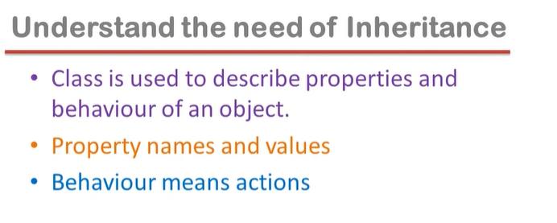

<u>Example of "Property names and values"</u>:

Roll number is the "name of the property" and 2058 is the "value of that property"...

(class mai hum property ke naam describe karte hai... aur  value hum property ki tabhi rakh sakte hai jab hum class ka bana le object...)

--

<u>"Behaviour means actions"</u>:

The functions that we make in the class are the Behaviours/ actions/ operations/ functions/ methods of that object...

(Apni class mai describe karte hai kisi bhi object ke liye kya properties hongi aur kya functionalities hongi...)

--

Let us assume that we want to represent a car.

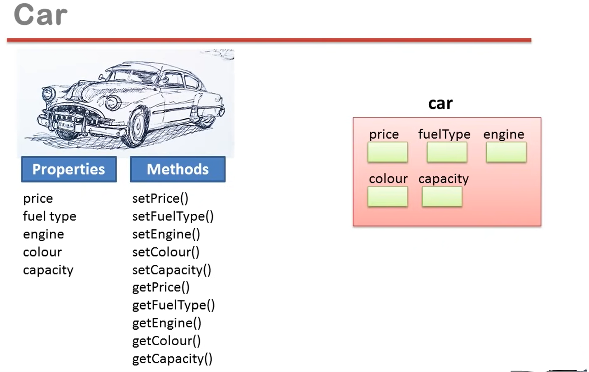

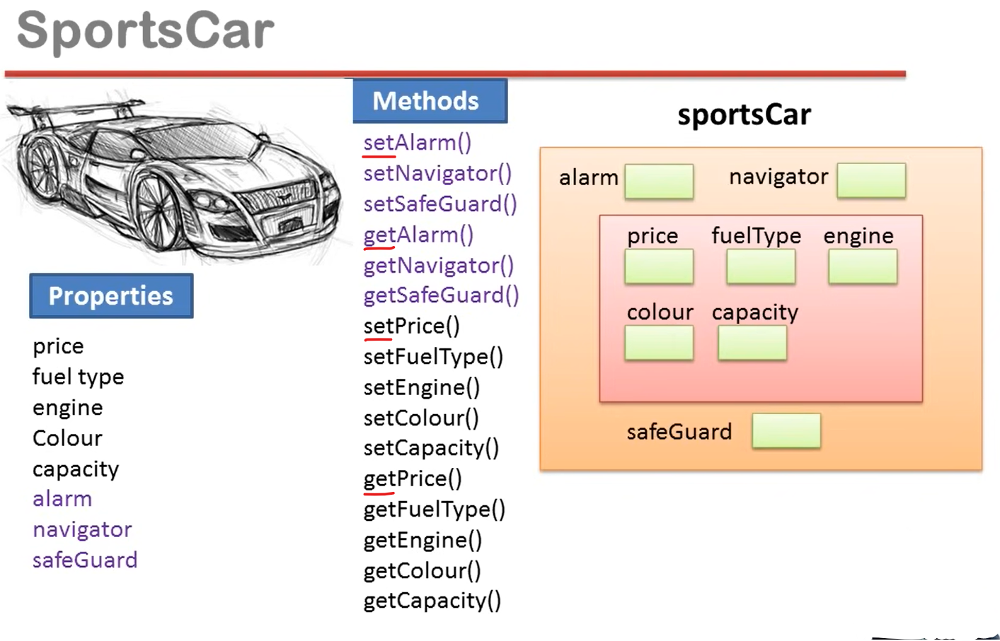

Incapsulation Rule:    =>    (Aap ek Entity se related saari information ek hi Object mai rakhna...)

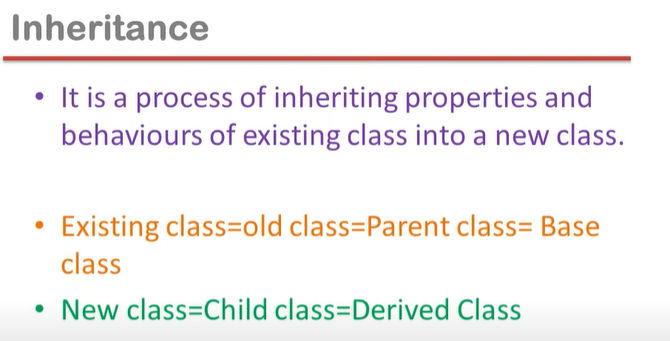

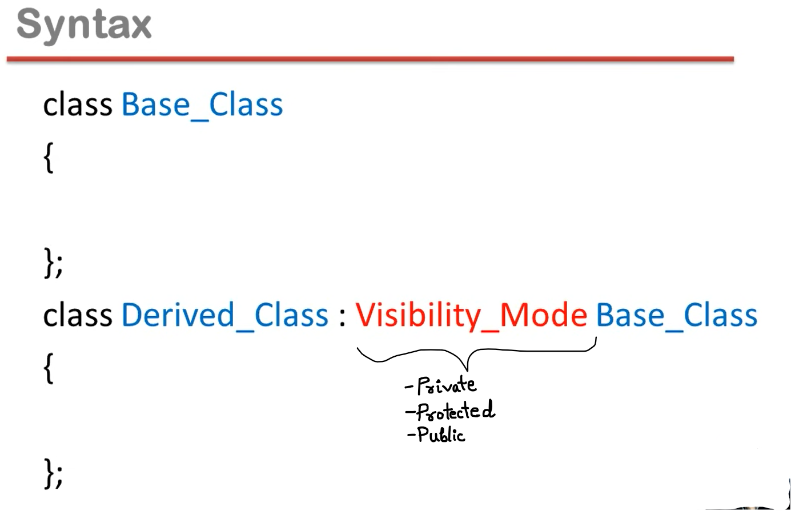

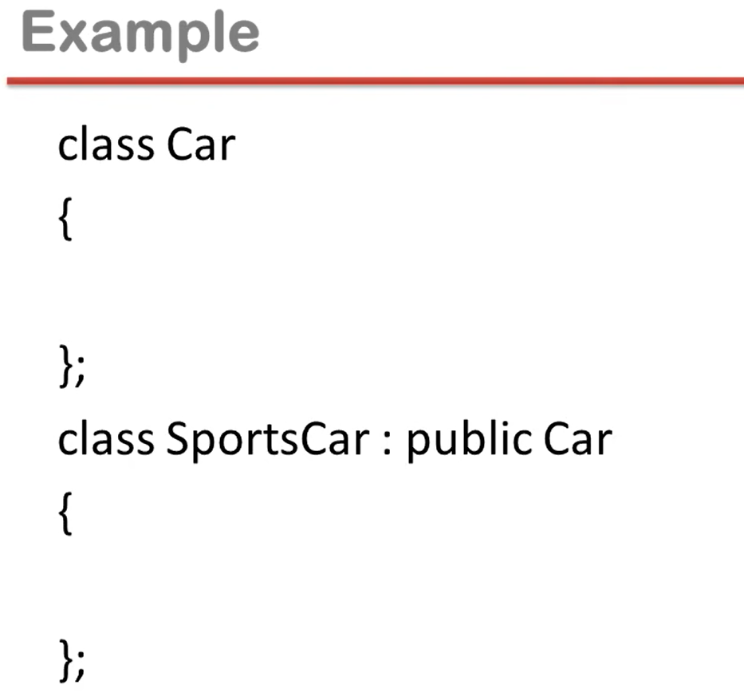

--------

## Lec 38 - lnheritance in C++ (Part 2)

Types of Inheritance:

- Single Inheritance

- Multilevel Inheritance

- Multiple Inheritance

- Hierarchical Inheritance

- Hybrid Inheritance

**<u>Single Inheritance</u>**:

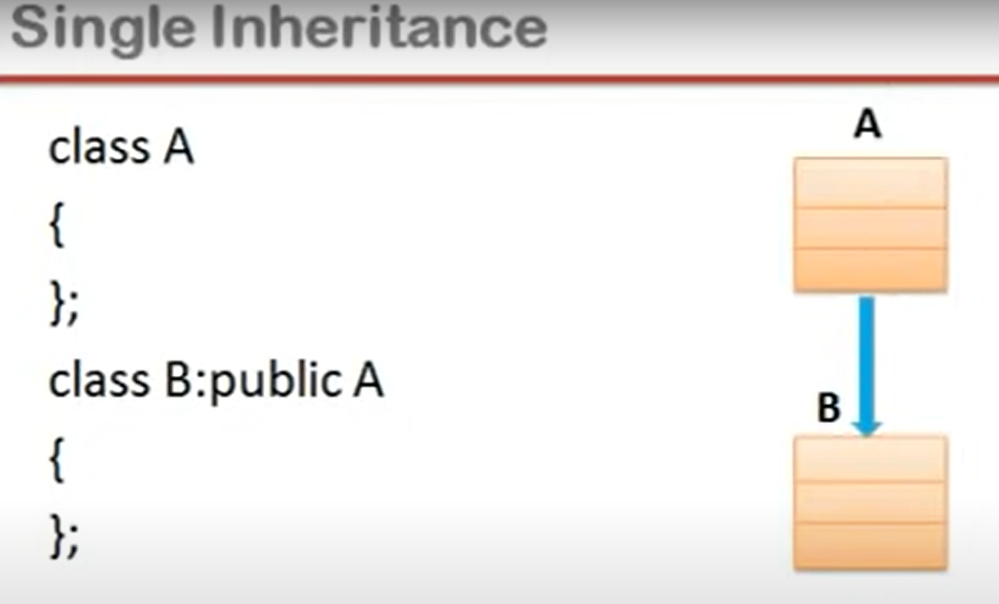

class B:public A

class B: A    =>    means    class B:private A

**<u>Multilevel Inheritance</u>**:

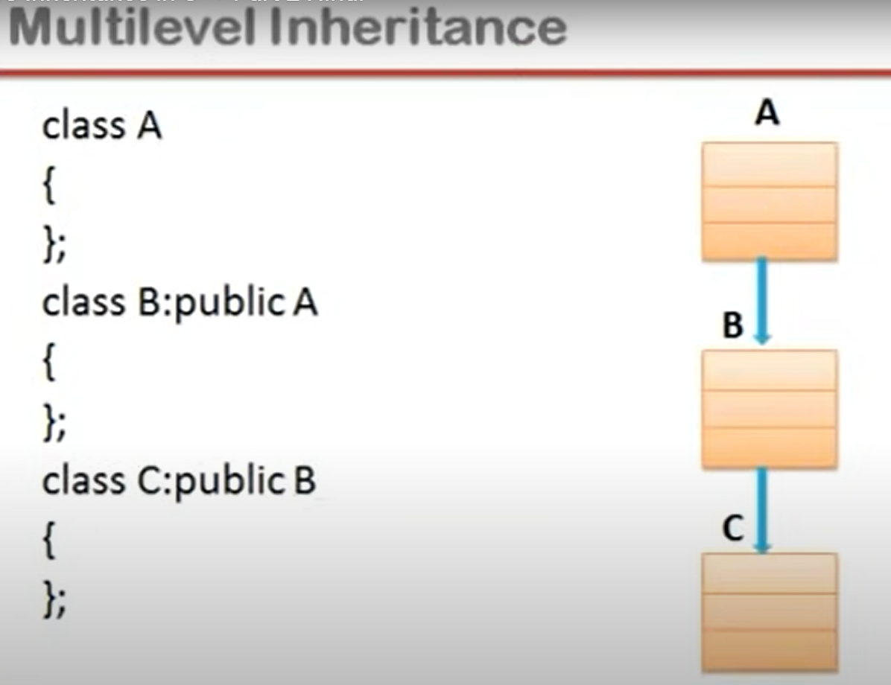

**<u>Multiple Inheritance</u>**:

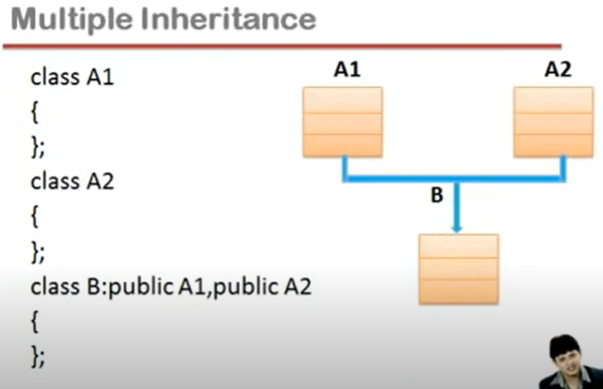

**<u>Hierarchical Inheritance</u>**:

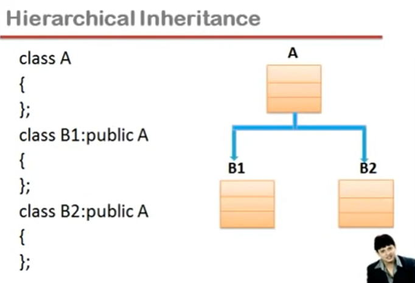

**<u>Hybrid Inheritance</u>**:

-----------------+--------------------


**Availability Vs Accessibility**:

(In Availability Inheritance, child class got every member of the parent class..)

Private member ho..., Protected member ho... ya Public Member ho... Object banane pr teeno tarah ke members available hote hai....

Lekin Accessible sirf Public members hote hai...

--

Note: 

Private Accessible nahi hota...

So, Private members are not Accessible by User 1 and User 2 but Protected Members are not accessible by User 1 but accessible by User 2... 

---------+------------

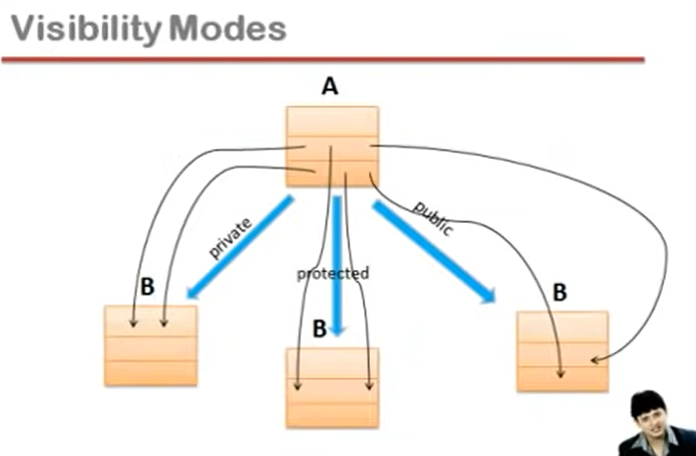

(~~Time stamp~~ : for understanding.... Lec 39 => 15:35 - 16:40)

```cpp
#include<iostream>
using namespace std;
class A
{
    private:
        int a;
    protected:
        void setValue(int k)
        {a=k;}
};
class B: public A            //B is a child class of A
{
    public:
        void setData(int x)
           {
                setValue(x);
            }
};
int main()
{
    B obj;
   // obj.setValue(4);    //Shows Error
    obj.setData(4);    //setData is public member of B class...
    return 0;
}
```

---------

## Lec 39 - lnheritance in C++ (Part 3)

**<u>Is-a relationship</u>**:-

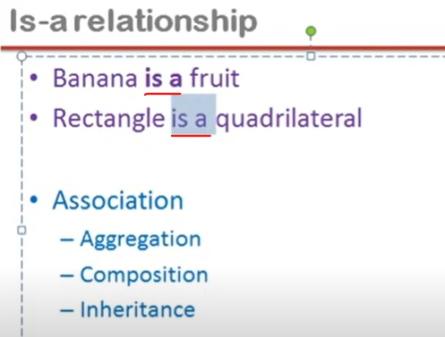

Association    :- Relationship between two classes

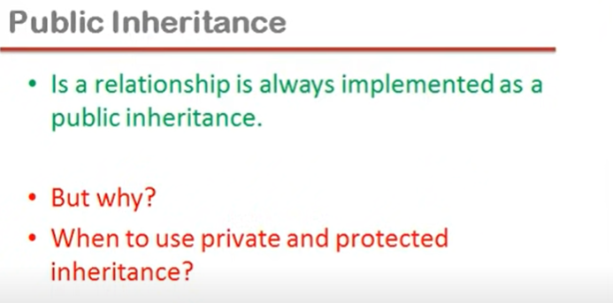

```cpp
// When to use public inheritance
#include<iostream>
using namespace std;
class Car
{
    private:
        int gear;
    public:
        void incrementGear()
        {
            if(gear<5)
            gear++;
        }
};
class SportsCar:public Car    //When to use public inheritance
{

};
```

```cpp
// When to use private and protected inheritance?
#include<iostream>
using namespace std;
class Array
{
    private:
        int a[10];
    public:
        void insert(int index, int value)
        { 
            a[index]=value; 
        }
};
class STACK: public Array
{
    int top;
    public:
        void push(int value)
        {
            insert(top,value);
        }
};
int main()
{
    STACK s1;
    s1.push(34);
    s1.insert(2,56);
    return 0;
}
```

s1.insert(2,56);    //    =>    First we call the insert function and then assign the 56 in index 2...

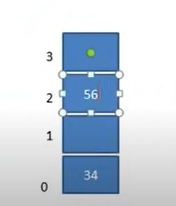    //Result of => class STACK: public Array    i.e. index 1 gets vacant...

NOTE:

Stack is implimented as an Array...

can't vacant any block in the array i.e.(Top mai hi value store honi chahiye...)

So, we need private inheritance 

class STACK: private Array

so that all indices (indexes)  filled in series... i.e. index 0 => 34,    index 1 => 56.... and so on... 

--------

## Lec 40 - Constructor and Destructor in lnheritance in C++ (Part 1)

Questions:

- We know that constructor is invoked implicitly when an object is created.

- In inheritance, when we create object of derived class, what will happen?

NOTE:

child class's constructor calls the parent class constructor...

```cpp
#include<iostream>
using namespace std;
class A
{
    public:
        A()
        {    }
};
class B: public A
{
    public:
        B():A()
        {    }
};
int main()
{
    B obj;
}
```

When compiler sees that there is no any constructor we made in the class B, then compiler will make constructor as well as write the neccessary steps to call the constructor of parent class A... But these steps are not present in the body of the child class constructor.... instead it will be like...

<mark>B():A()</mark>    //    => So this is the way to call the constructor of parent class...

--

Q. In case of Inheritance, what is the order to run the constructors?

Answer: From Parent to Child...

--

Q. In case of Inheritance, what is the order to call the constructors?

Answer: From Child to Parent...

(Here, pehle B (Child) ka constructor call hua... phir A (Parent) ka call hua... lekin execute pehle A (Parent) ka hua phir B (Child) ka hua...)

```cpp
#include<iostream>
using namespace std;
class A
{
    int a;
    public:
        A(int k)
        {  a=k;  }
};
class B: public A
{
    int b;
    public:
        B(int x, int y):A(x)    //SEE
        { b=y; }
};
int main()
{
    B obj(2,3);
}
```

We need to pass the Argument in A... So that error will not show...

NOTE:

child class ka constructor parent class ke constructor ko karta hai call... bahut baar hume child class mai constructor baanana jarruri pad jata hai... agar parent class mai default constructor present nahi hai... aaur parent constructor ko call karne ki jimewari bhi humaari hai...

------+----------

**Destructor**:

We create Destructor to release the memory of the resources of the object...

(Har wo kaam karne ke liye jo object ke khatam hone ke just pehle ho jaani chahiye...)

```cpp
#include<iostream>
using namespace std;
class A
{
    int a;
    public:
        A(int k)
        {  a=k;  }
        ~A()
        {    }
};
class B: public A
{
    int b;
    public:
        B(int x, int y):A(x)
        { b=y; }
        ~B()
        {    }
};
int main()
{
    B obj(2,3);
}
```

NOTE:

Here, pehle B (child) ka call hua... phir child (B) ne A (parent) ka call kiya...

But in the case of Destructor; First child will execute its own destructor then parent destructor will execute...

(Compiler khud parent ke destructor ko call karne wale step likh dega... Here, no need to pass argument...)

-----------

## Lec 41 - this pointer in C++ (Part 1)

**<u>Object Pointer</u>**:

A pointer contains address of an object is called Object pointer.

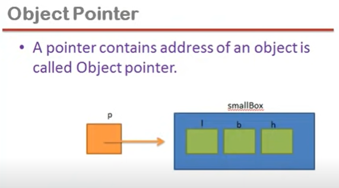 

```cpp
// this pointer
#include<iostream>
using namespace std;
class Box
{
    private:
        int l,b,h;
    public:
        void setDimension(int x, int y, int z)
        {  l=x; b=y; h=z; }
        void showDimension()
        {
            cout<<"\nl= "<<l<<" b= "<<b<<" h="<<h;
        }
};
int main()
{
    Box *p,smallBox;
    p=&smallBox;

    p->setDimension(12,10,5);        //    pointer name used here...
    /*    
            smallBox.setDimension(12,10,5);    //object name used  here
            smallBox.showDimension();    
    */
    p->showDimension();
    return 0;
}
```

smallBox.setDimension(12,10,5);     //object name used here

p->setDimension(12,10,5)     // pointer name used here...

--

Conclusion:

arrow will use with the pointer

dot will use with the object

-----------+------------------

**<u>this pointer</u>**:

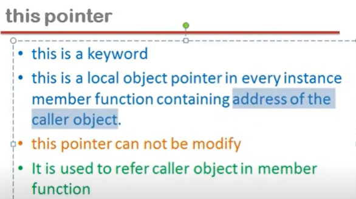

this: it is a pointer variable...

--

local : local variable...i.e. Variable made inside any particular function... (kisi particular function ke ander bana variable hoga...)

--

<u>Instance member function</u>:    

Functions made inside the class are the instance member function... (since, without "static" keyword...)

e.g. from the program:     setDimension, showDimension

--

NOTE:

Inside every instance member function there is always a "this" pointer exists...

```cpp
// this pointer    //same as previous
#include<iostream>
using namespace std;
class Box
{
    private:
        int l,b,h;            //SEE
    public:
        void setDimension(int l, int b, int h)    //SEE contd....
       // {  l=l; b=b; h=h; }    //    shows  issue
       { this->l=l; this->b=b; this->h=h; }  //solved the name conflict
        void showDimension()
        {
            cout<<"\nl= "<<l<<" b= "<<b<<" h="<<h;
        }
};
int main()
{
    Box smallBox;
    smallBox.setDimension(12,10,5);    //object name used  here
    smallBox.showDimension();
    return 0;
}
```

NOTE:

Here, "local variable" name is l,b,h and also "instance member variable" name is also l,b,h but both  are different... (l,b,h alag variable hai jo object ke ander hai aur alg hai jo functions ke ander hai...)

so, there should be some conflict with    { l=l; b=b; h=h; }

since "this" used to represent caller object... ("this" is an object pointer...)

so, To represent the member of  caller object, "this" helps to solve the problem of name conflict....

i.e.    { this->l=l; this->b=b; this->h=h; }

-----------

## Lec 42 - new and delete in C++ (Part 1)

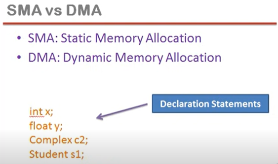

Static Memory Allocation (SMA) (or) Compile time memory Allocation

 Note:

Compile time memory Allocation ka matlab ye hai ki memory kitni allocate hone wali hai variable ke naam pr... ye <mark>compile time</mark> mai decide ho jata hai...

and

Memory ka allocation tab hota hai jab program run hona start hota hai... Program jab run hota hai tab wo RAM mai aata hai aur RAM ke ander variables ko memory milti hai...

--

<u>DMA</u>:

It helps to decide how much memory we required.... And we create that much of required variables during the <mark>run time</mark>...

--

<u>Advantage of DMA over SMA</u>:

SMA don't give us the flexibility in the memory...

--------+------------

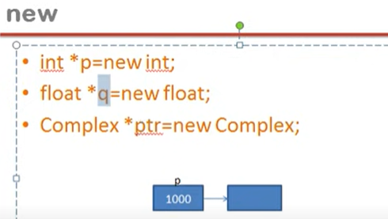

NOTE:

Variables made from keyword "new" are called DMA variables.....

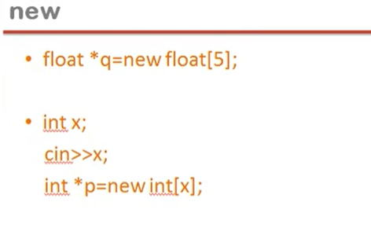

**<u>delete</u>**:

- delete p;

- delete [ ]p;

delete keyword is used to release the memory that is created by the keyword "new"

(Remember:    delete is only to release the memory of DMA variables...)

-------

## Lec 43 - Method Overriding in C++ (Part 1)

- Method Overloading

- Method Overriding

- Method Hiding

**<u>Method Overriding</u>**:

When function made in parent and child class with exactly same name and with same prototype and Arguments.... but may be there is difference in the coding, then it is called Method Overriding...

**<u>Method Hiding</u>**:

When we made a function in <mark>parent class</mark> and <mark>child class</mark> with same name but different Arguments are called Method Hiding...

**<u>Function/Method Overloading</u>**:

Function name same but difference in the Arguments in the <mark>SAME</mark> class...

```cpp
// Example on Method Overriding and Method Hiding
#include<iostream>
using namespace std;
class A
{
    public:
        void f1(){    }    //Method Overriding
        void f2(){    }    //Method Hiding
};
class B:public A
{
    void f1(){    }    //Method Overriding
    void f2(int x){    }        //Method Hiding
};
```

Method Overriding:

e.g.:    void f1( ){        }

Method Hiding:

e.g:    void f2( ){      }     and     void f2(int x){         }

```cpp
// Example (previous program)
#include<iostream>
using namespace std;
class A
{
    public:
        void f1(){    }    //Method Overriding
        void f2(){    }    //Method Hiding
};
class B:public A
{
    void f1(){    }    //Method Overriding
    void f2(int x){    }        //Method Hiding
};

int main()
{
    B obj;
    obj.f1();    //B (i.e. works in class B since obj is of class B)
    obj.f2();    // ERROR will show...
    obj.f2(4);    //B
}
```

<u>Early Binding Concept</u>:

Here in this case, when we write <mark>obj.f1( )</mark>, so compiler have to decide which f1( ) were calling of class A or class B.... aur jo version chalna chahiye usko iss call ke saath kar diya jaayega Bind...

<mark>obj.f2( )</mark>    => Agar f2( ) naam ka function... B (child) class mai hota hi nahi... to wo A (parent) class mai jata aur wo f2( ) function ko bind karta... aur Parent wala version bind ho jata...pr yaha (i.e. in class B) f2() wala function exist karta hai Bhale hi Argument different hai...

Since, Naam match kar gaaya hai to compiler parent class mai nahi jaayega...

Aur phir compiler dekhega f2( ) ke Arrguments match nahi kar rahe hai to <mark>ERROR</mark> show kar dega...

```cpp
// Example on We want child functionality will work only not parent...
// Overriding Example...
#include<iostream>
using namespace std;
class Car
{
    public:
        void shiftGear(){    }    //Method Overriding
};

class SportsCar:public Car
{
    // void gearChange(){    }
       void shiftGear(){    }    //Method Overriding
};


void main()
{
    SportsCar obj;
    obj.shiftGear();        //SportsCar
    // obj.gearChange();        //SportsCar
    return 0;
}
```

-------------
