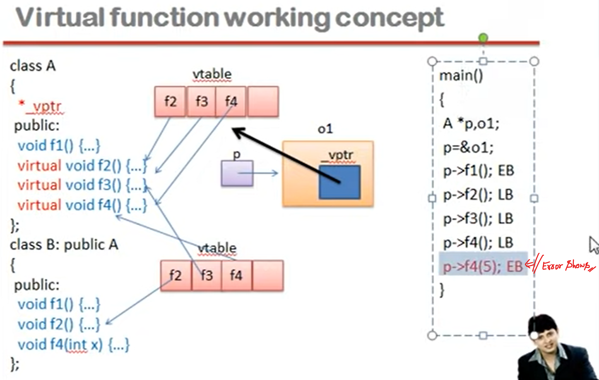
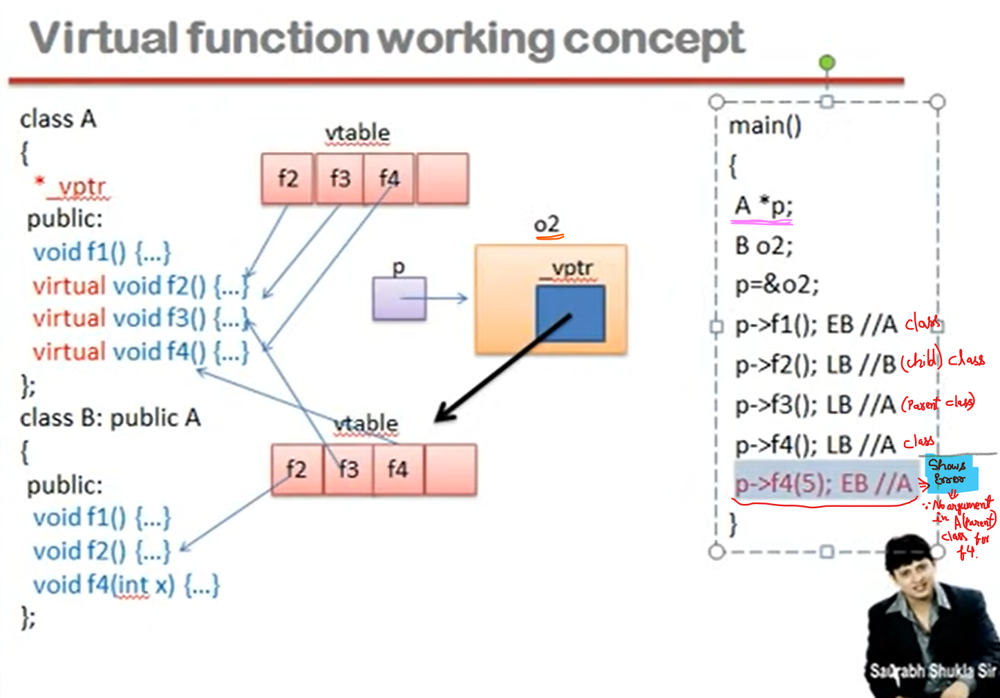
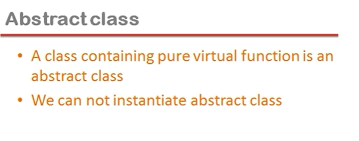
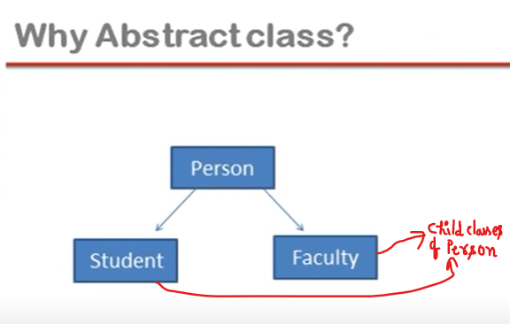
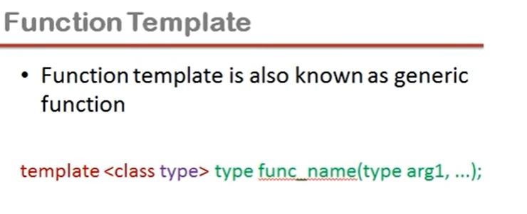
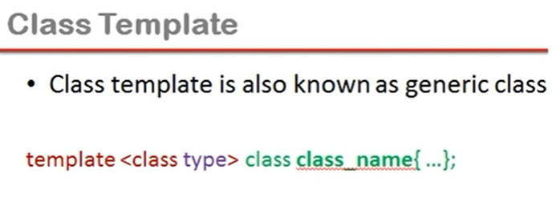
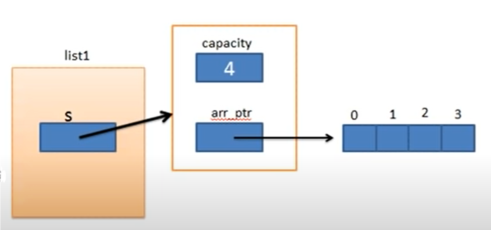
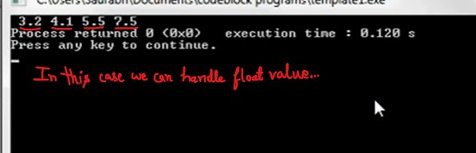

## Lec 44 - Virtual Function in C++ (Part 1)

Base class Pointer:

- Base class pointer can point to the object of any of its descendant class

- But its converse is not true

Note:

Agar pointer parent class ka banate hai to uske child class ka object ka address contain kar sakta hai...

but child class pointer can't points parent's object...

```cpp
#include<iostream>
using namespace std;
class A
{
    public:
        void f1() {    }    //function Overriding
};
class B: public A
{
    public:
        void f1() {    }    //function Overriding
        void f2() {    }
};
int main()
{
    A *p,o1;
    B o2;
    p=&o2;
    // o2.f1(); //B(child) class f1() will work...
    p->f1();   //A(Parent) class f1() will work...
}
//See next program
```

p->f1( )    //=>  Here,  p will not able to find out o1 ka address hai ya o2 ka address hai...

pointer ka type declaration ke time pata lag gaya tha (    A *p,o1;    )... i.e. pointer ka type hai "A". Early binding karte waqt compiler... pointer ke type ko dekhega... na ki pointer ke content ko...

Conclusion:

Function ko call agar object ke dwara kiya ja raha hai to object ke type ko dekhte hai...

Pointer ke dawara agar function ko call kar rahe hai to pointer ke type ko dekhte hai...

parent ke pointer ke through calling ho raha hai to... child ka object banane ke baad bhi child wala f1( ) nahi chal raha hai... aaur ye problem hai...

(The purpose of Overriding is that for child class object... latest child definition will works...)

To solve this problem the solution is to not proceed Early Binding  

We need LATE BINDING in the run time... because in run time we can know the content of the pointer... and which address pointer contains...

```cpp
// Solution (same as previous program)

#include<iostream>
using namespace std;
class A
{
    public:
    virtual void f1() {    }    //SEE
};
class B: public A
{
    public:
        void f1() {    }    //function Overriding
        void f2() {    }
};
int main()
{
    A *p,o1;
    B o2;
    p=&o2;
    // o2.f1(); //B(child) class f1() will work...
   // p->f1();  //A(Parent) class f1() will work... // WRONG //see below
    p->f1();    // f1() of child(B) class will work...
}
```

virtual void f1() { }    =>    Now compiler understand that f1() function will have LATE BINDING...

In late binding, call ke waqt pointer ke type ko aadhar nahi mana jaayega... pointer ke content of aadhar mana jaayega... aaur pointer B(child) ke object ko point kar raha hai... issi liye child ke object wala f1( ) function call ho raha hai...

virtual function is recommended in the case of Function Overriding...

f1() is also a virtual function in child class which is no need to declare (Since, f1() is declared virtual in parent class...)

----------

## Lec 45 - Virtual Function in C++ (Part 2)

In any class if even atleast one virtual function exists... for that class compiler will declare a pointer / <mark>variable</mark> in the class as a member from its side...



*_vptr    =>   pointer / <mark>variable</mark> made by compiler and this varible is an Instance member variable...

*_vptr exists for both class A and class B

vptr is a pointer... and it contains Address of Array...

(Jitne objects banyenge sabhi ke liye alag alag vptr banega...)

vtable is a Static Array of function pointers... and it doesn't depends on Object...

EB:    Early Binding    (In Early Binding, Compiler sees the pointer type... )

LB:    Late Binding



Conclusion:

In Early Binding, Compiler sees the pointer type... and thats the issue of Overriding...

object f1() to humne child ka banaya hai... aur child wala f1 nahi chal raha...

ye dekhte hi nahi ki pointer mai kis object ka Address hai...

So, we use Virtual Function for Early Binding....

(AND)

Aagr Late Binding hoti hai to run time pe pointer ka type nahi... pointer kisko point kar raha hai usko dekha jata hai... Aur pointer jisko point kar raha hota hai uske ander <mark>vptr</mark> hota hai jo <mark>vtable</mark> ko point karta hai... Aur vtable mai virtual function ke addresses hote hai...

----------

## Lec 46 - Abstract Class in C++ (Part 1)

**<u>Pure Virtual function</u>**:

<mark>A do nothing function is called pure virtual function</mark>.

(Ek aisa function jiski koi definition na ho usee pure virtual function bol sakte hai...)

void fun( )=0; 

(i.e. function should be assign to 0... So compiler will know that function is of "Do Nothing" nature...)

here, Overriding should be required in the child class....

NOTE:

Person class having "do nothing function" can't make Objects...

```cpp
#include<iostream>
using namespace std;
class Person
{
    public:
    /*    
            void fun()=0;    //do nothing function
    */
     virtual void fun()=0;    // Pure virtual function //SEE Note
};
class Student:public Person
{
    public:
        void fun()
        {

        }
}
```

Note:

Because of early binding parent class version will work(kyuki pointer parent class ka hai...) to ek aur tarika hai ki hum parent class ke ander "do nothing function" ko call sakte hai...

To stops call of "do nothing function" in the parent class... So, need to stop Early Binding...

So, It is important to make fun() function VIRTUAL...  i.e. virtual void fun()=0; So, now it will have Late Binding...

virtual void fun()=0; It is known as Pure Virtual Function...

NOTE:

Abstract Class:-   Class in which atleast One Pure Virtual Function is present, is called Abstract Class... and these class can't have/create any object...





Student and Faculty classes are sub-category... and Person is a Super-Category of Student and Faculty classes...

Making of Person class's object is wrong in this... Person class is made just to provide the common features of student and faculty classes...

If don't want to make the object of person class.... It is done by making Person class into Abstract class... by using Pure Virtual Function in it....

----

## Lec 47 - Template in C++ (Part 1)

Template:-

- The keyword template is used to define function template and class template

- It is a way to make yourfunction or clas generalize as far as data type is concern.

Note:- Template is a type of Format...

Template use in making of:

- Function Template    //    Generic Function

- Class Template    //    Generic Class


```cpp
//Only Datatype is different but the function is same...
// Example of Function Overloading....
#include<iostream>
using namespace std;
int big(int a, int b)
{
    if(a>b)
        return a;
    else
        return b;
}

double big(double a, double b)
{
    if(a>b)
        return a;
    else
        return b;
}

int main()
{
    cout<<big(4,5);
    cout<<big(5.6,3.4);
}
```

If we are using Function overloading just because function is same, coding is  same even number of Arguments are same but Only Datatype (i.e. Here, int and double) is different... So, Template helps to solve this issue by making single version of function...




e.g.:    template < class X > X big(X a, X b)

```cpp
// Solution of Previous Example... Use of TEMPLATE:

#include<iostream>
using namespace std;

//template <class X> X big(X a, X b)
template <class X>
X big(X a, X b)
{
    if(a>b)
        return a;
    else
        return b;
}

int main()
{
    cout<<big(4,5);
    cout<<big(5.6,3.4);
    return 0;
}
```

template    =>    Keyword...

X    =>    Place holder... (We can change name of Place holder anything...)

Place holder replace by DataType...

```cpp
//Use of Template For two arguments of different DataTypes...
#include<iostream>
using namespace std;

template <class X, class Y>    //SEE
X big(X a, Y b)
{
    if(a>b)
        return a;
    else
        return b;
}

int main()
{
    cout<<big(4,5);
    cout<<big(5.6,3.4);
    return 0;
}
```

-------------

## Lec 48 - Template in C++ (Part 2)




```cpp
#include<iostream>
using namespace std;

class ArrayList
{
    private:
        struct ControlBlock
        {
            int capacity;
            int *arr_ptr;
        };
        ControlBlock *s;
    public:
        ArrayList(int capacity)
        {
            s=new ControlBlock;
            s->capacity=capacity;
            s->arr_ptr=new int[s->capacity];
         }
         void addElement(int index, int data)
         {
              if(index>=0&&index<=s->capacity-1)
                   s->arr_ptr[index]=data;
              else 
                   cout<<"\nArray index is not valid";  
          }
          void viewElement(int index, int &data)
          {
               if(index>=0&&index<=s->capacity-1) 
                   data=s->arr_ptr[index];
               else
                    cout<<"\nArray index is not valid";
           }
           void viewList()
           {
                int i;
                for(i=0;i<s->capacity;i++)
                    cout<<" "<<s->arr_ptr[i];
            }
};
int main()
{
    int data;
    ArrayList list1(4);
   /*
    list1.addElement(0,32);
    list1.viewElement(0,data);
    cout<<"Value in the array is "<<data;
    */
    list1.addElement(0,32);
    list1.addElement(1,41);
    list1.addElement(2,55);
    list1.viewList();   
}
```



Member function is access through the Pointer...

and Structure is access with the help of Arrow operator...


Conclusion of above program:

Humne aisa array bana liya hai jisme hum Array ko declare karte waqt ArrayList ka object banate waqt jo size mention karenge... to Array uss size ka ban jaayega... Aur usme hum utni values rakh paayenge...


```cpp
//Solution of previous Example for different Datatype issue...
//Using "template"
#include<iostream>
using namespace std;

template<class X>class ArrayList
{
    private:
        struct ControlBlock
        {
            int capacity;
            X *arr_ptr;    //SEE //replced by "X"
        };
        ControlBlock *s;
    public:
        ArrayList(int capacity)
        {
            s=new ControlBlock;
            s->capacity=capacity;
            s->arr_ptr=new X[s->capacity];    //SEE
         }
         void addElement(int index, X data)    //SEE
         {
              if(index>=0&&index<=s->capacity-1)
                   s->arr_ptr[index]=data;
              else 
                   cout<<"\nArray index is not valid";  
          }
          void viewElement(int index, X &data)    
          {
               if(index>=0&&index<=s->capacity-1) 
                   data=s->arr_ptr[index];
               else
                    cout<<"\nArray index is not valid";
           }
           void viewList()
           {
                int i;
                for(i=0;i<s->capacity;i++)
                    cout<<" "<<s->arr_ptr[i];
            }
};
int main()
{
    int data;
    ArrayList <int>list1(4);   //Need to mention the DataType...
    list1.addElement(0,32);
    list1.addElement(1,41);
    list1.addElement(2,55);
    list1.viewList();   
}
```

ArrayList < int>list1(4);    //Need to mention the DataType... i.e. int, float etc... here datatype is "int"...

ArrayList < float>list1(4);    //Here Datatype is "float"


```cpp
//Solution of previous Example for different Datatype issue...
//Here datatype is "float" 
//Using "template"
#include<iostream>
using namespace std;

template<class X>class ArrayList
{
    private:
        struct ControlBlock
        {
            int capacity;
            X *arr_ptr;    //SEE //replced by "X"
        };
        ControlBlock *s;
    public:
        ArrayList(int capacity)
        {
            s=new ControlBlock;
            s->capacity=capacity;
            s->arr_ptr=new X[s->capacity];    //SEE
         }
         void addElement(int index, X data)    //SEE
         {
              if(index>=0&&index<=s->capacity-1)
                   s->arr_ptr[index]=data;
              else 
                   cout<<"\nArray index is not valid";  
          }
          void viewElement(int index, X &data)    
          {
               if(index>=0&&index<=s->capacity-1) 
                   data=s->arr_ptr[index];
               else
                    cout<<"\nArray index is not valid";
           }
           void viewList()
           {
                int i;
                for(i=0;i<s->capacity;i++)
                    cout<<" "<<s->arr_ptr[i];
            }
};
int main()
{
    int data;
    ArrayList <float>list1(4);    //DataType is float here...
    list1.addElement(0,3.2);
    list1.addElement(1,4.1);
    list1.addElement(2,5.5);
    list1.addElement(3,7.5);
    list1.viewList();   
}
```



-----------


 
