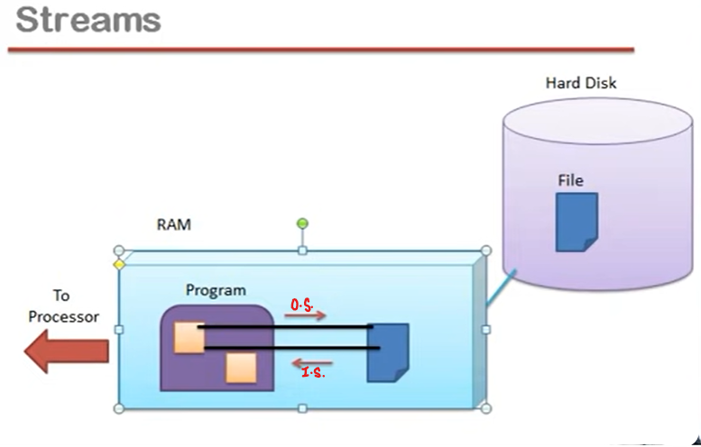
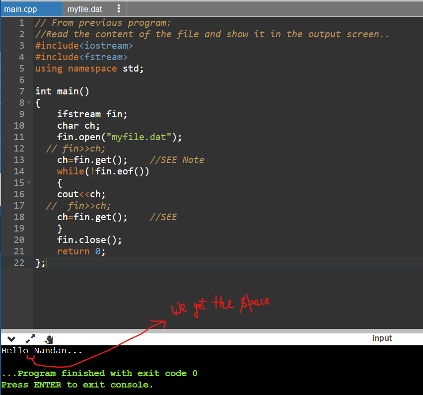

## Lec 49 - File Handling in C++ Part 1

**<u>Data Persistence</u>**: 

- Life of Data (i.e. Data ka Existance)



Output Stream    (Data go from  Variable  ----to----->  File  )

Input Stream    ( Data came to Variable  <----from----    File  )

Output stream and Input Stream can be handle in C++ using Pre-defined class...

Objects can be made to represent Output Stream and Input Stream...

----+-------


We need to make the objects for the classes : ifstream, fstream and ofstream

**ofstream**: If want to write in the file and want the output then we need to make ofstream object...

- Output stream can be represented by object of class ofstream...

**ifstream**: 

- Input stream can be represented by object of class ifstream...

**fstream**:


```cpp
#include<fstream>
#include<iostream>
using namespace std;

int main()
{
    ofstream fout;
    fout.open("myfile.dat");
    fout<<"Hello";
    fout.close();
    return 0;
}
```

#include< fstream>    =>    In this header file... ifstream, fstream and ofstream are declared...

fout =>    fout is an object here...

open() function is a member function of class ofstream...

myfile.dat :=> It is a file name (OR) we can even write the path of the file... This file exist in the harddisk...

-------------------

## Lec 50 - File Handling in C++ Part 2

Program to read the content of the file and show it in the output screen...

    //Read the content of the file and show it in the output screen..
    #include<iostream>
    #include<fstream>
    using namespace std;
    
    int main()
    {
        ifstream fin;
        char ch;
        fin.open("myfile.dat");
        fin>>ch;
        while(!fin.eof())
        {
        cout<<ch;
        fin>>ch;
        }
        fin.close();
        return 0;
    };

**Note**:

Here, myfile.dat is already exists in the harddisk...

cin>>ch;    //cin is associated with the keyboard
fin>>ch;    //fin is associated with the file i.e. Here, myfile.dat...

eof()    =>    eof() means "end of file"...

 OUTPUT:

Reason for <mark>no space</mark> in the output is that this Extraction operator (i.e. >>) which helps to read the value from the file and put in the "ch" and this Extraction operator (i.e. >>) consider "<mark>space</mark>", "<mark>tab</mark>" and "<mark>next line</mark>" as special symbols which is Data Separators... so Extraction operator (i.e. >>) doesn't read it (i.e. Space) and doesn't put in the "ch"... so "space" does not display in the output...

fin>>ch;    =>    fin calls its Extraction operator (i.e. >>) and passed reference of "ch" as an Argument... 

(reference: Section: Operator Overloading... )

*SOLUTION of THE ISSUE*:

```cpp
// From previous program:
//Read the content of the file and show it in the output screen..
#include<iostream>
#include<fstream>
using namespace std;

int main()
{
    ifstream fin;
    char ch;
    fin.open("myfile.dat");
  // fin>>ch;
    ch=fin.get();    //SEE Note
    while(!fin.eof())
    {
    cout<<ch;
  //  fin>>ch;
    ch=fin.get();    //SEE
    }
    fin.close();
    return 0;
};
```

Note:

We will use get() function instead of Extraction operator (i.e. >>)... which returns the character which it reads...

get() function doesn't consider <mark>space</mark> as Data Separator...



----------

## Lec 51 - File Handling in C++ Part 3


ios::in    =>    It is  a constant value which determines that we opens the file to read it....

ios::out    =>    It means that we want to open file for writing in the File...

NOTE: 

While opening file in this mode leads to ERASE of Older Data... and writing of the content in the file is from the new way....

ios::app    =>    If we want that the older content of the file will not delete/Erase and writing of new things will add after the Older Content...

ios::ate    =>    If we want to do random operation in the file or Modification...

```cpp
fout.open("myfile.dat");    //Default Argument Concept...
//older content will erase and file will open like blank file...

fout.open("myfile.dat",ios::out);    //Same Meaning of Above line...
//Mentioning of "file mode" as a second Argument...
```

    //Opening of file in multiple modes:
    
    
    fout.open("myfile.dat",ios::app|ios::binary|ios::in);

ios::binary    =>    


default mode for "ofstream fout;"     =>    ios::out

default mode for "ifstream fin;"     (for read)       =>    ios::in


File open in <mark>Binary mode</mark>:

e.g.:            fout.open("myfile.dat",ios::app|<mark>ios::binary</mark>|ios::in);

File open in <mark>text mode</mark>:

e.g.:            fout.open("myfile.dat",ios::app|ios::in);


Here, in above case "\n" changes the line into new line...

"\n" doen't write as it is....

("cout" gives output in the Monitor...)


Here, in above case of "fout"    =>     "\n" doen't write as it is....

("fout" gives ouput in the file)

Note:

If file is open in <mark>Binary Mode</mark>, then "\n" will write as it is in the file...

If file is open in <mark>Text Mode</mark>, then "\n" will doesn't write as it is in the file... instead "\n" changes the line into new line...

------------

## Lec 52 - tellg and tellp in C++ language

NOTE:    "g" means "get" and "p"  means "put"

**<u>tellg()</u>**:


Note:

- tellg() function is a member function in istream class....
  
  streampos is a predefined class... (or) return type (or) Assume it as simple integer value...

**<u>tellp()</u>**:


```cpp
//Example of tellg()
#include<iostream>
#include<fstream>
#include<conio.h>
using namespace std;
int main()
{
    ifstream fin;
    fin.open("abc.txt");
    int pos;    //pos => position
    pos=fin.tellg();
    cout<<pos;
    getch();
}
```

Note:

abc.txt contains some string or character...


```cpp
//From previous program: contd. tellg()
#include<iostream>
#include<fstream>
#include<conio.h>
using namespace std;
int main()
{
    ifstream fin;
    char ch;
    fin.open("abc.txt");
    int pos;    //pos => position
    pos=fin.tellg();
    cout<<pos;
    fin>>ch;
    pos=fin.tellg();
    cout<<pos;
    fin>>ch;
    pos=fin.tellg();
    cout<<pos;
    getch();
}
```


tellg() tells that- character ko read karne wala get pointer kis position ko point kar raha hai in input stream...

```cpp
//Example of tellp()
#include<iostream>
#include<fstream>
#include<conio.h>
using namespace std;
int main()
{
    ofstream fout;
    char ch;
    fout.open("abc.txt",ios::app);
    int pos;    //pos => position
    pos=fout.tellp();
    cout<<pos;
    fout<<"mysirg";
    pos=fout.tellp();
    cout<<pos;
    fout.close();
    getch();
}
```

    "put" pointer in ofstream class which is inside "fout"... points last block...


In append mode    =>    fout.open("abc.txt",ios::app);

Where the string ends... just after that block "put" pointer points... and that block is considered as ZEROth block...


------------------

## Lec 53 - seekg and seekp functions in C++

NOTE:    "g" means "get" and "p" means "put"

**<u>seekg()</u>**:


**<u>way</u>** values are pre-defined  constants...

beg means begining, cur means current...


**<u>seekg()</u>**: This is an important function for accessing file randomly (i.e. kisi bhi portion se data read karna hai...)

streampos    =>   Pre-defined class... Assume it as simple integer value...


```cpp
// Want to read file abc.txt    //Use of seekg()

#include<iostream>
#include<fstream>
#include<conio.h>
using namespace std;
int main()
{
    ifstream fin;
    fin.open("abc.txt");
    cout<<fin.tellg();
    cout<<"\n"<<(char)fin.get();
    cout<<(char)fin.get();
    cout<<"\n"<<fin.tellg();
    fin.seekg(0);    //position of string is zero in abc.txt
//fin.seekg(6);    //position of string is 6 in abc.txt
    cout<<"\n"<<fin.tellg();
    cout<<"\n"<<(char)fin.get();
    cout<<"\n"<<fin.tellg();
    getch();
}
```

get() is a function which is used to read the character...

seekg() function decides that whom get( ) pointer points...


```cpp
// From Previous
// Want to read file abc.txt    //Use of seekg()

#include<iostream>
#include<fstream>
#include<conio.h>
using namespace std;
int main()
{
    ifstream fin;
    fin.open("abc.txt");
    cout<<fin.tellg();
    cout<<"\n"<<(char)fin.get();
    cout<<(char)fin.get();
    cout<<"\n"<<fin.tellg();
    fin.seekg(0);    //position of string is zero in abc.txt
//fin.seekg(6);    //position of string is 6 in abc.txt
    cout<<"\n"<<fin.tellg();
    cout<<"\n"<<(char)fin.get();
    cout<<"\n"<<fin.tellg();
    fin.seekg(2,ios_base::cur);    //SEE
    cout<<"\n"<<fin.tellg();
/*    
    fin.seekg(2,ios_base::beg);    //SEE
    cout<<"\n"<<fin.tellg();
*/ 
/*    
    fin.seekg(-2,ios_base::end);    //SEE
    cout<<"\n"<<fin.tellg();
    cout<<"\n"<<(char)fin.get();
*/    
    getch();
}
```


```cpp
//Want to write in the file abc.txt    //Use of seekp()

#include<iostream>
#include<fstream>
#include<conio.h>
using namespace std;
int main()
{
    ofstream fout;
    fout.open("abc.txt",ios::ate);
    cout<<fout.tellp();    //tellp() tells the current position   
    getch();
}
```


```cpp
//From Previous program
//Want to write in the file abc.txt   //Use of seekp()

#include<iostream>
#include<fstream>
#include<conio.h>
using namespace std;
int main()
{
    ofstream fout;
    fout.open("abc.txt",ios::ate|ios::app);
    cout<<fout.tellp();    //tellp() tells the current position
    fout<<"ABCDEFG";
    cout<<fout.tellp();
    fout.close();    //It is compulsory for the changes in the file
    getch();
}
```

NOTE:  Here, File  contains "ABCDEFG"

```cpp
//From Previous program
//Want to write in the file abc.txt   //Use of seekp()

#include<iostream>
#include<fstream>
#include<conio.h>
using namespace std;
int main()
{
    ofstream fout;
    fout.open("abc.txt",ios::ate|ios::app);
    cout<<fout.tellp();    //tellp() tells the current position
  //  fout<<"ABCDEFG";
    fout.seekp(2,ios_base::beg); //We change the position of "put" pointer
    cout<<fout.tellp();
    fout.close();
    getch();
}
```

-------------


