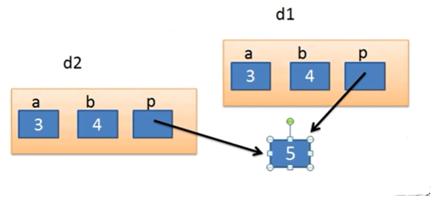
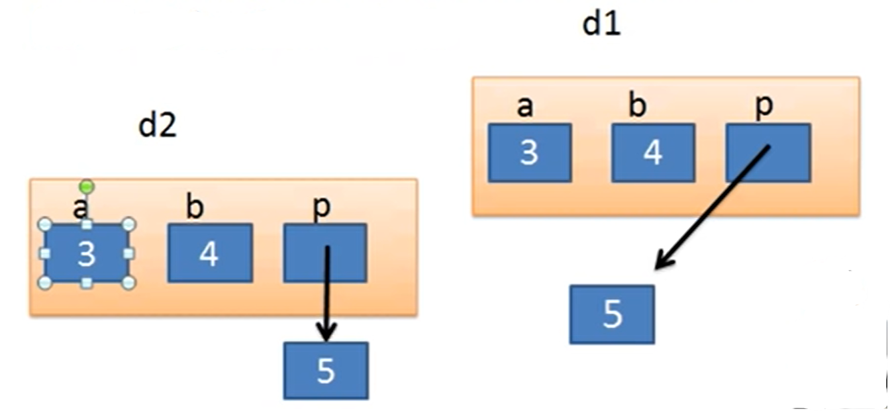
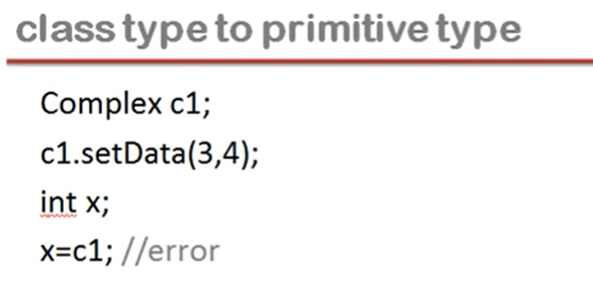
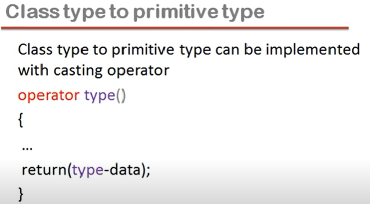
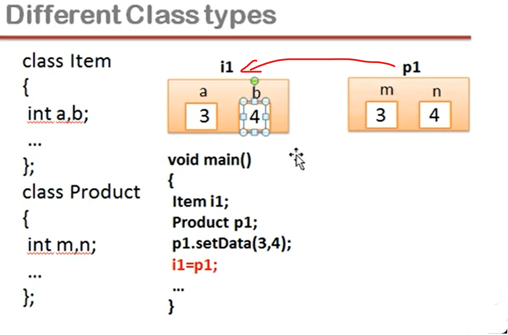

## Lec 54 - lnitializers in C++

What is initializer?


```cpp
//Example
#include<iostream>
using namespace std;
class Dummy
{
    private:
        int a,b;
    public:
      /*  Dummy()
        {    a=5;    }    */

        Dummy():a(5),b(6)        //Initializer List
        {    }
};
```

Note: Constructor (i.e. here, Dummy) ka naam wahi hota hai jo class ka naam hota hai...

```cpp
// Where "Initializer list" required     //Example

#include<iostream>
using namespace std;
class Dummy
{
    private:
        int a,b;
        const int x;        //SEE
    public:
        Dummy():x(5)        //Initializer List reqired
        {    }
};
void fun()
{    }
```

```cpp
//contd...
//In these type of cases shows Error...
    private:
        int a,b;
        const int x;
    public:
        Dummy()  
        {  x=5;  }        //SEE
/* Note x=5; shows Error because of const in "const int x;"
i.e. Hum constructor mai "const " instance variable ko initialise 
nahi kar sakte...
*/
```

```cpp
//Another Example using "reference variable" in the class
// Where "Initializers" required

#include<iostream>
using namespace std;
class Dummy
{
    private:
        const int x;
        int &y;            //reference variable
    public:
        Dummy(int &n):x(5),y(n)    //Initializer list
        {    }
};
int main()
{
    int m=6;
    Dummy d1(m);    //"m" reference had passed here...
}
```

Note: 

"reference variable" ko banate waqt hi initialise karna padta hai...

Agar "reference variable" member variable ke roop mai banaya jaa raha hai, to initialisers use hoga...


-----------------

## Lec 55 - Deep Copy and Shallow Copy in C++

**<u>Copy</u>**:

How we can create a copy of object?

- Copy constructor

- Implicit copy assignment operator (OR) Default assignment operator


```cpp
//Example of Shallow copy
//Copy constructor

#include<iostream>
using namespace std;
class Dummy
{
    private:
        int a,b;
    public:
        void setData(int x, int y)
        {    a=x; b=y;    }
        void showData()
        {    cout<<"\na="<<a<<" b="<<b;    }
};
int main()
{
    Dummy d1;
    d1.setData(3,4);
    Dummy d2=d1;    //SEE    //Copy Constructor call
    d2.showData();
    return 0;
}
```

~~SEE from 6:20~~

<u>Copy constructor</u> calls when we make object (d2) of any class (Dummy) and initialise with other object (d1) of same class (Dummy)....

```cpp
//From previous example contd...
//Implicit copy assignment operator
int main()
{
    Dummy d1;
    d1.setData(3,4);
    Dummy d2; /*SEE - Here, Copy Constructor doesn't call because 
we are not initialising it */
    d2=d1;    //Constructor doesn't run...
/* Constructor runs when object create, So here copy contructor 
does not call but here assignment operator calls...*/
//COPY ASSIGNMENT  OPERATOR
    d2.showData();
    return 0;
}
```

**<u>Shallow Copy</u>**:

- Creating copy of object by copying data of all member variables as it is.

```cpp
//Example Copy constructor    //Shallow copy

#include<iostream>
using namespace std;
class Dummy
{
    private:
        int a,b;
    public:
        void setData(int x, int y)
        {    a=x; b=y;    }
        void showData()
        {    cout<<"\na="<<a<<" b="<<b;    }
        Dummy(Dummy &d)        //SEE
        {  
            a=d.a; b=d.b;
         }
};
int main()
{
    Dummy d1;
    d1.setData(3,4);
    Dummy d2=d1;    //SEE    //Copy Constructor call
    d2.showData();
    return 0;
}
```

<mark>Dummy(Dummy &d)</mark>    =>    We took Dummy class reference in Dummy constructor...

and d => d contains d1 reference.... (d2 object bante hi... d1 as an argument pass ho raha hai... i.e. <mark>Dummy d2=d1;</mark>)

<mark>a=d.a;</mark>     =>   d2 ke "a" mai... d1 ka "a" assign ho jaaye...

<mark>b=d.b;</mark>    =>    "b" mai assign ho jaaye... d2 ka "b"...

----------+---------------

**<u>Deep Copy</u>**:

- Creating an object by copying data of another object along with the values of memory resources resides outside the object but handled by that object.

```cpp
//Deep copy
//Problem Issue - check NOTE
#include<iostream>
using namespace std;
class Dummy
{
    private:
        int a,b;
        int *p;        //SEE
    public:
        Dummy()        //Constructor
        {
            p=new int;
        }
        void setData(int x, int y, int z)    //3 Arguments passed
        {    a=x; b=y;  *p=z;  }    //SEE
        void showData()
        {    cout<<"\na="<<a<<" b="<<b;    }
        Dummy(Dummy &d)        //SEE
        {  
            a=d.a; b=d.b; p=d.p;
         }
};
int main()
{
    Dummy d1;
    d1.setData(3,4,5);   //SEE 
    Dummy d2=d1;    //SEE     //Copy Constructor call
    d2.showData();
    return 0;
}
```



NOTE:

Problem is that if something is changed in "p" of d2 then automatically for d1 "p" also gets changed because of sharing (i.e. pointers pointing the same resource...) And this is dangerous...

So, for d1 and d2 we want different memory resource... So, Its important to make "Copy constructor" by ourselves...

```cpp
//Deep copy
//Solution of Problem Issue... pevious example contd... 
#include<iostream>
using namespace std;
class Dummy
{
    private:
        int a,b;
        int *p;        //SEE
    public:
        Dummy()        //Constructor
        {
            p=new int;
        }
        void setData(int x, int y, int z)    //3 Arguments passed
        {    a=x; b=y;  *p=z;  }    //SEE
        void showData()
        {    cout<<"\na="<<a<<" b="<<b;    }
        Dummy(Dummy &d)        //SEE
        {  
            a=d.a; b=d.b;    //SEE+++
            p=new int;
            *p=*(d.p);
         }
         ~Dummy()            //Destructor for memory release...
         {
            delete p;
          }
};
int main()
{
    Dummy d1;
    d1.setData(3,4,5);   //SEE 
    Dummy d2=d1;    //SEE     //Copy Constructor call
    d2.showData();
    return 0;
}
```

d.p    =>    means d1 ka "p"

*(d.p)    =>    variable (i.e. value => 5) which is pointing by "p" of d1

*p= *(d.p);    =>    means "p" of d2 representing the variable (i.e. value => 5)



Conclusion:

Object ke member variables ka hi data sirf copy <mark>nahi</mark> hua hai... also object jis resource ko point kar raha hai uska data bhi copy hua hai (i.e. Deep mai jaa ke copy hua hai...)

Note:

Shallow copy is not recommended when object contains pointer... and pointer accessing the outside memory location...

So, Deep Copy  required....

------+-------

In shallow copy, pointer "p" of both object d1 and d2 pointing to the same variable... So, even in delete of any one object d1 or d2 leads to delete of the variable(which is containing 5) because of "Destructor" i.e. <mark>~Dummy()</mark>. 

Aur hum jaante hai ki agar ek object bhi delete ho to resource (i.e. variable) delete ho jata... to dusra object to exist kar raha hai na... to uska pointer usi location ko (i.e. where variable ***was*** existing) point karta... jo ki delete ho chuka hai.... To ye Invalid Memory location ho jata... i.e. pointer ke ander ka address INVALID ho jata... to ye ek illegal memory access ko lead karta... jisse program CRASH hone ke chance hote...


Dangling Pointer :- Pointer pointing the location where memory is already released i.e. Pointer pointing the location which is not Valid now...

-------

## Lec 56 - Type Conversion Primitive to class type in C++

Primitive type:

- int, char, float double are primitive types

- Non-primitive data types (or) class type is any class you defined


<u>Demerit</u>:

In Datatype conversion, there may be some Data loss i.e. e.g: Float to  int etc...


```cpp
// Error problem in Primitive type to class type
#include<iostream>
using namespace std;
class Complex
{
    private:
        int a, b;
    public:
        void setData(int x, int y)
        {    a=x; b=y;    }
        void showData()
        {    cout<<"\na="<<a<<" b="<<b;    }
};
int main()
{
    Complex c1;
    int x=5;
    c1=x;    //Error i.e. Cannot convert 'int’ to ’Complex’
//Solution of the error is use of Constructor...
    c1.showData();
    return 0;
}
```


- Primitive type to class type can be implemented through constructor


```cpp
// Solution by using constructor
#include<iostream>
using namespace std;
class Complex
{
    private:
        int a, b;
    public:
        Complex()   { } //Default Constructor required for "No argument" 
        Complex(int k)                //  constructor with int Argument
        {    a=k; b=0;    }
        void setData(int x, int y)
        {    a=x; b=y;    }
        void showData()
        {    cout<<"\na="<<a<<" b="<<b;    }
};
int main()
{
    Complex c1;
    int x=5;
    c1=x;    // Now no error
    c1.showData();
    return 0;
}
```

Now <mark>no error</mark> because Constructor tabhi call hote hai jab object mai dusre type ki value assign hogi... i.e. c1 object mai complex type ki value assign hone ki jagah kisi dusre type ki value jaise "int" ki value assign ho rahi hai... to automatically c1 ke liye wo Constructor call ho jaayega jo ek "int" argument leta hai... 


c1=x;    //    c1.Complex(x)     (<=    Only for understanding... It's not a Syntax)

It means... c1 ke liye "complex" naam ka constructor call ho gaya... aur usme "x" ki value as an argument pass ho gayi... 

---------------

## Lec 57 - Type Conversion Class type to primitive type in C++




```cpp
//Error in Class type to primitive type
#include<iostream>
using namespace std;
class Complex
{
    private:
        int a, b;
    public:
        void setData(int x, int y)
        {    a=x; b=y;    }
        void showData()
        {    cout<<"\na="<<a<<" b="<<b;    }
};

int main()
{
    Complex c1;
    c1.setData(3,4);
    c1.showData();
    int x;
    x=c1;        //Error    //Cannot convert 'Complex' to 'int'
    cout<<"\nx="<<x;
    return 0;
}
```




```cpp
// Solution by using casting operator
#include<iostream>
using namespace std;
class Complex
{
    private:
        int a, b;
    public:
        void setData(int x, int y)
        {    a=x; b=y;    }
        void showData()
        {    cout<<"\na="<<a<<" b="<<b;    }
        operator int()                //SEE - use of casting operator
        {
            return a;   //return(a);
        }
};

int main()
{
    Complex c1;
    c1.setData(3,4);
    c1.showData();
    int x;
    x=c1;        //Error    //Cannot convert 'Complex' to 'int'
    cout<<"\nx="<<x;
    return 0;
}
```

x=c1;    //    x=c1.operator int();    (<=    Not a syntax, only for understanding...)

It means c1 calls the casting operator aur casting operator jo bhi return karega wo "x" mai jaayega...

--------

## Lec 58 - Type Conversion one class type to another class type in C++

 




- For different class types... Error will cause... because this conversion is not possible...

- If type of classes are same then error will not show because "Copy assignment operator" will work here...


NOTE:

- If we want to use the <mark>constructor</mark> for the conversion then for "object" in left side of the Assignment operator (i.e. =) i.e. i1... constructor will use... it means constructor "item class" mai banana hoga...    (Note: Assignment operator (i.e. =) ke right side mai hota hai... wo Constructor ka Argument hota hai...)

- If we want to use the <mark>casting operator</mark> for the conversion then for "object" in right side of the Assignment operator (i.e. =) i.e. p1... casting operator will use... it means hume "product class" mai casting operator banana padega...


```cpp
//Error
#include<iostream>
using namespace std;
class Item
{
    private:
        int a,b;
    public:
        void showData()
        {    cout<<"\na="<<a<<" b="<<b;    }
};
class Product
{
    private:
        int m,n;
    public:
        void setData(int x, int y)
        {    m=x; n=y;    }
};
int main()
{
    Item i1;
    Product p1;
    p1.setData(3,4);
    i1=p1;
    i1.showData();
    return 0;
}
```

Error showing:

- Illegal use of pointer

- Cannot convert 'Product' to 'ltem'


```cpp
//Solution of the Error Using the Constructor 
#include<iostream>
using namespace std;
class Product
{
    private:
        int m,n;
    public:
        void setData(int x, int y)
        {    m=x; n=y;    }
         int getM()                    //see
         {    return(m);    }
         int getN()                    //see
         {    return(n);    }
};
class Item
{
    private:
        int a,b;
    public:
        void showData()
        {    cout<<"\na="<<a<<" b="<<b;    }
        Item()    {    }    //default constructor required here
        Item(Product p)    //Constructor of Item class
 /* 
       {
            a=p.m;
            b=p.n;
        }    
    m and n can't access like this because m and n are private members...
*/
        {
            a=p.getM();    //getM() is public
            b=p.getN();    //getN() is public
        }
};

int main()
{
    Item i1;
    Product p1;
    p1.setData(3,4);
    i1=p1;
    i1.showData();
    return 0;
}
```


Item(Product p)    //    =>    p stores data of p1  

p.m    &    p.n    //    =>    means ye wahi values hongi jo p1 ke "m" aur "n" mai hongi... aur ye copy ho raha hai i1 ke "a" aur "b" ke ander...


~~SEE 9:30~~     (<=    for reason of making default constructor....)

Item() {     }     //default constructor required here because item class ka object banate waqt... hume Argument pass karne ki jarrurt nahi hai... 


~~SEE 11:40~~


---------------------
